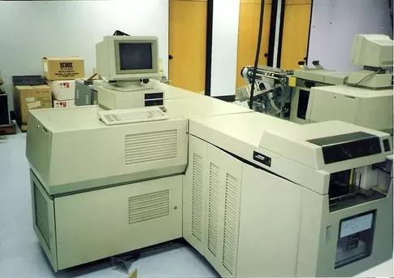
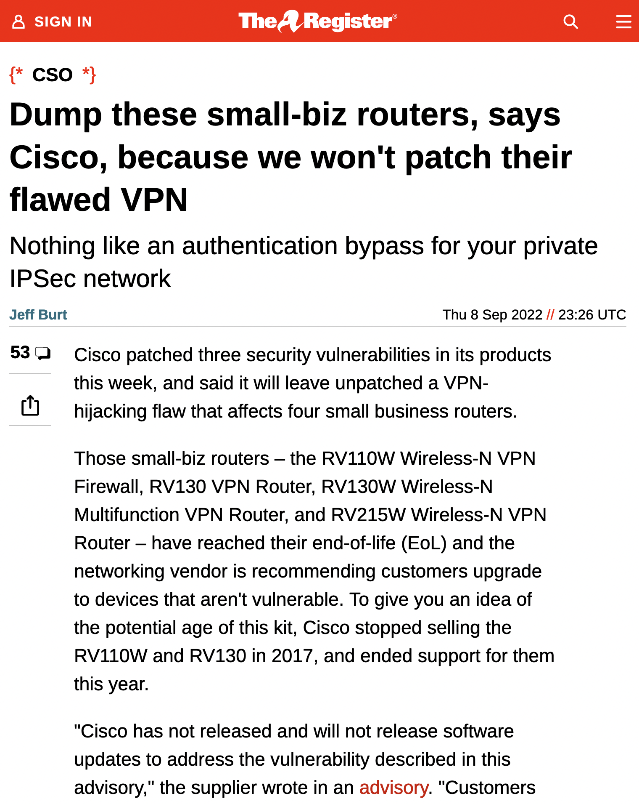
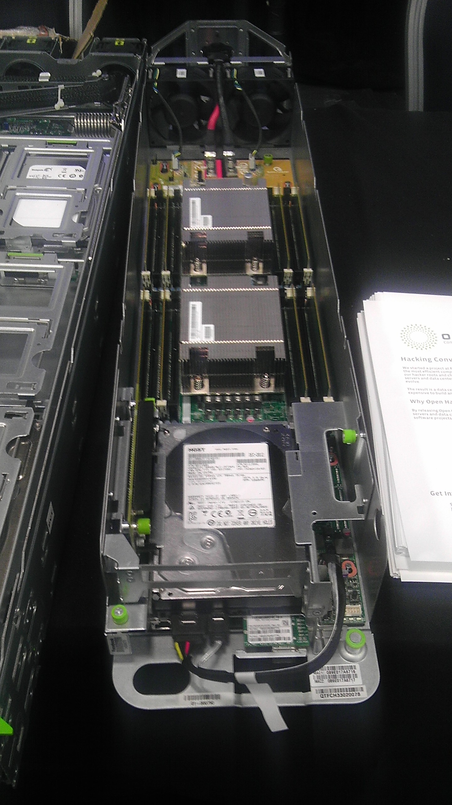
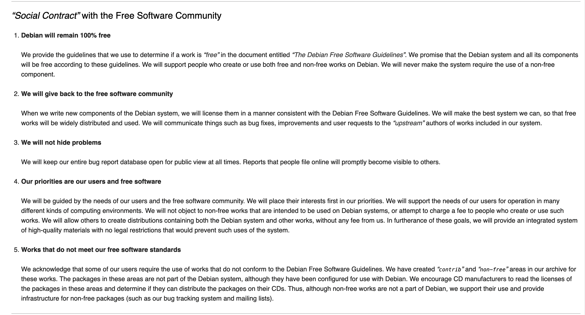

autoscale: true
slidenumbers: true
build-lists: true
slide-transition: true

# Mineure OSS @ EPITA
## Session 1

---

# Plan de la session

- Présentation du cours
- Petites phrases / slogans / mythes fondateurs
- Un peu d'histoire / émergence des concepts

---

# Présentation du cours

---

# Description du cours

Ce cours vise à enseigner aux élèves de l’EPITA l’ingénierie, la gestion de produit et de projet, et les pratiques commerciales et organisationnelles de l’open source.

Il se composera de 12 modules de 3h (cours magistraux incluant pour certains les témoignages d’intervenants ponctuels + séance "hors les murs" à l'OSXP).

Il est à noter que ce cours est moins axé sur la technologie et plus les aspects économiques, juridiques et organisationnels de l’industrie du logiciel libre.

---

# Objectifs pédagogiques

- Comprendre le fonctionnement des projets open source
- Comprendre les aspects clés de l'industrie du logiciel
- Comprendre comment l'open source change l'industrie du logiciel
- Opérationaliser ces connaissances, afin de pouvoir les mettre en application, que ce soit dans le cadre d'une entreprise ou d'une organisation existante, ou d'une startup

---

# Pourquoi s'en préoccuper ?

En ~20 ans, le logiciel libre a radicalement changé la façon dont les logiciels sont :

[.column]
- conçus,
- développés,
- construits (*build*)
- testés,
- promus,

[.column]
- vendus,
- maintenus,
- enseignés,
- déployés,
- ...

---

# Pourquoi s'en préoccuper ?

Relations (parfois complexes) avec (entre autres):

- Les méthodes agiles
- Le cloud
- Les réseaux sociaux et les plateformes
- L'économie de l'immatériel et du secteur non-marchand
- Les ressources humaines et l'organisation des entreprises
- L'innovation
- Le financement des startups
- La production et le partage de ressources immatérielles autres que le logiciel
- La souveraineté numérique
- ...

---

# Pourquoi s'en préoccuper ?

Implication de disciplines comme:

- Le droit
- Le génie logiciel
- L'économie et les sciences de gestion
- L'anthropologie
- Les sciences politiques
- L'éthique (branche de la philosophie)
- ...

---

# Pourquoi s'en préoccuper ?


Un marché de 6 Mrd d'€, soient plus de 10% du marché informatique (logiciels et services) en France.

7% à 10% de croissance annuelle prévus d'ici 2025 (selon les secteurs).

---

# Pop quiz

- Logiciel libre et open source: pareil ou pas ?
- Logiciel libre => gratuit ?
- Citer un logiciel libre emblématique (pourquoi ?)
- Citer une personnalité emblématique du LL (pourquoi ?)
- Citer une organisation (non commerciale) emblématique du LL (pourquoi ?)
- Citer une entreprise emblématique du LL (pourquoi ?)

---

# Qui je suis


**Stefane Fermigier**: entrepreneur français et activiste du logiciel libre et des libertés numériques. Il est le fondateur et le PDG d'Abilian, une société qui développe des solutions de gestion de l'information d'entreprise basées sur des logiciels open source. Auparavant, il avait fondé  en 2000 Nuxeo, une société qui a été vendue en 2021 pour 150 M$. Auparavant, il a été enseignant-chercheur en mathématiques à l'Université Paris VII.
<br>
Il est également co-fondateur depuis 25 ans d'une demi-douzaines d'organisations dédiées à la promotion et à la défense du logiciel libre et du numérique ouvert, en France et en Europe, ainsi que de plusieurs conférences sur ces mêmes sujets.

---

# Qui je suis (vraiment)

- Découverte des logiciels libres au début des années 90 (ex: Linux 0.11, en décembre 1991)
  - Oui, il va y avoir des souvenirs d'ancien combattant dans ce cours
- Contact avec Bernard Lang puis fondation de l'AFUL en 1998
- Fondation de Nuxeo en 2000
- Départ de Nuxeo en 2012 et fondation d'Abilian
- Actuellement co-président du CNLL et de l'APELL
- Discours forcément biaisé par des convictions et des expériences personnelles

---

# Qui je suis (vraiment)

- Première année que je donne ce cours
  - Plan et parfois contenu basé sur des cours existants (Di Cosmo, Riehle, Zacchiroli...)
  - Timing difficile à prévoir *a priori*
  - Manque de familiarité avec les us et coutumes de l'école
- Co-construction du cours avec les étudiants
  - Quelle est votre expérience actuelle ?
  - Quelles sont vos attentes ?
  - Personnelles ? Professionnelles ?
- Contact (si besoin): sf@fermigier.com ou @sfermigier sur Telegram

---

# Planning

12 séances de 3h (le mardi de 14h à 17h)

Non définitif: pourra évoluer en fonction, notamment, de vos retours

---

# Planning (1)

[.build-lists: false]

- **[13 sept.] Concepts, histoire, fondamentaux**

    - Poser les problématiques, faire connaissance
    - Histoire et concepts fondateurs
    - TD: lire/commenter un des textes fondateurs

- **[20 sept.] L'industrie du logiciel: les fondamentaux**

    - Plateformes & Ecosystèmes
    - Innovation ouverte
    - La filière française du LL (étude PAC, études emploi)

- **[27 sept.] Aspects juridiques et éthiques**
    - Cours sur le juridique
    - TD: analyse / discussion sur 1 ou plusieurs licences
    - Numérique éthique et LL (discussion du projet de charte du CNLL)

---


# Planning (2)

[.build-lists: false]

- **[11 oct.] Production des logiciels libres**
    - Cf. "Producing Open Source Software" de Karl Fogel

- **[18 oct.] Les écosystèmes du logiciel libre**
    - Intervention d'un représentant d'une fondation (TBD)

- **[25 oct.] Modèles économiques**
    - [2h] Présentation des modèles économiques
    - [1h] Intervention d'un entrepreneur du libre ? (TBD)

---

# Planning (3)

[.build-lists: false]

- **[8 nov.] Participation à la conférence “Open Source Expérience” à Paris (“OSXP”)**

- **[15 nov.] Débrief OSXP + Modèles économiques (suite)**
    - Exposés rapides de débrief de l'OSXP
    - Intervention d'un entrepreneur du libre (Ludovic Dubost, XWiki)

- **[22 nov.] Enjeux stratégiques et géopolitiques**
    - Dont intervention de Jean-Paul Smets (Nexedi / Rapid.Space / Euclidia)

---

# Planning (4)

[.build-lists: false]

- **[29 nov.] Inner sourcing & OSPOs**
    - [3h] Cours assuré par Florent Zara (Henix / Eclipse Foundation)

- **[6 dec.] Logiciels libres et politiques publiques**
    - [1h] "20 ans de politiques publiques du LL"
    - [2h?] intervention de B. Guerry, responsable de la MIssion Logiciel Libre au sein de la DINUM / Etalab

- **[13 dec.] Soutenance des projets**
    - Volume horaire à moduler en fonction du nombre d'inscrits
    - Compléments TBD

---

# Autres intervenants

Plusieurs experts interviendront ponctuellement sur des sujets précis ou pour des retours d'expériences concrets, notamment:

- **Bastien Guerry**: chef de la “Mission logiciel libre” au sein de la DINUM (= “OSPO de l’Etat francais”)
- **Florent Zara**: directeur technique et expert Open/Inner Source de Henix, éditeur de la suite logicielle Open Source Squashtest.
- **Jean-Paul Smets**: PDG de Rapid.Space, fondateur de Nexedi et créateur du logiciel libre "ERP5" utilisé par plusieurs groupes du CAC40.
- **Ludovic Dubosc**: Entrepreneur Open Source, créateur de XWiki, fondateur et PDG de XWiki SAS, qui développe et édite les logiciels open source XWiki et CryptPad.

---

# Projet

Le projet proposé aux élèves visera à mettre en pratiques plusieurs des notions clefs abordées en cours:

- En groupe: faire correspondre des produits open source à des exigences réalistes d'une entreprise ou d'une catégorie d'entreprises
- Pour chaque étudiant du groupe: choisir un produit à analyser en profondeur
- Identifier les caractéristiques clefs de ce produit et du projet associé
- Mettre en oeuvre ce logiciel dans une plateforme de cloud (par exemple: Clever Cloud, Heroku, Nua...)
- Compléter l'évaluation "a priori" par un retour d'expérience opérationnelle
- Réaliser une "fiche produit" du logiciel retenu
- Présenter en public leur travail et leurs conclusions

---

# Bibliographie


**"Vers la souveraineté numérique: le pari des logiciels libres"**

A paraître en octobre (hopefully!)

(A droite: couverture provisoire)

---

# [fit] Bibliographie sommaire (en français)

- *Livret bleu "Fondamentaux juridiques"*. GTLL (2016). [PDF](https://cnll.fr/media/LivretBleu_Juridique-2eEdition_GT-LogicielLibre_Systematic_Nov2016_web.pdf)
- Par François Pellegrini et Sébastien Canevet, *Droit des logiciels: Logiciels privatifs et logiciels libres*. PUF (2013).
- *Etude 2021 sur la filière open source en France*. CNLL (2021). [PDF](https://cnll.fr/media/etude-cnll-2021.pdf).
- *Livret Bleu "Modèles économiques"*. GTLL (2014). [PDF](https://cnll.fr/media/LivretBleu_ModelesEconomiques_GT-LogicielLibre_Systematic.pdf).
- *The impact of Open Source software and hardware on technological independence, competitiveness and innovation in the EU economy - Résumé en français*. Commission européenne (2021). [PDF](https://cnll.fr/media/CNECT_OpenSourceStudy_FR_resume_executif.pdf).
- *Open source : une alternative aux grands fournisseurs du numérique*. Cigref (2018). [PDF](https://cnll.fr/media/Cigref-Open-source-Alternative-Grands-Fournisseurs-franchir-pas-open-source-Decembre-2018.pdf).
- Amel Charleux, *L'OPEN SOURCE ENTRE CONCURRENTS - Approche de la création et de l'appropriation de valeurs par les business models et la coopétition*. [PDF disponible ici](https://hal.archives-ouvertes.fr/tel-02523313).

---

# [fit] Bibliographie sommaire (en anglais)

- *What is free software?*. Free Software Foundation (2010). [WEB](https://www.fsf.org/about/what-is-free-software).
- Eric Raymond, *The Cathedral & the Bazaar: Musings on linux and open source by an accidental revolutionary*. O'Reilly Media, Inc (2001). [Disponible ici](http://www.catb.org/~esr/writings/cathedral-bazaar/).
- Karl Fogel, *Producing open source software: How to run a successful free software project*. O'Reilly (2020 pour la 2eme édition). [PDF disponible ici](http://producingoss.com/).
- Jono Bacon, *The Art of Community, 2nd ed.*. O'Reilly (2012). [PDF disponible ici](https://www.jonobacon.com/books/artofcommunity/).
- Shane Curcuru, *The Apache Way*. [WEB](http://theapacheway.com/).
- *The OSPO – A New Tool for Digital Government*. Open Forum Europe / OSPO Zone (2022). [PDF disponible ici](https://openforumeurope.org/publications/the-ospo-a-new-tool-for-digital-government/).
- Nadia Eghbal, *Roads & Bridges: The Unseen Labor Behind Our Digital Infrastructure*. Ford Foundation. [PDF disponible ici](https://www.fordfoundation.org/work/learning/research-reports/roads-and-bridges-the-unseen-labor-behind-our-digital-infrastructure/).
- Andrew J. Hall, *Open-Source Business Models: Making money by giving it away*. Santa Clara High Technology Law Journal (2017). [PDF disponible ici](https://digitalcommons.law.scu.edu/chtlj/vol33/iss3/3/).

---

# Note sur sur Bibliographie

Il y a plus de 1000 articles universitaires et ouvrages de références publiés sur le logiciel libre, qui est un sujet d'étude académique depuis la fin des années 90.

Si on recherche une semblant d'exhaustivité, on pourra se reporter aux bibliographies des thèses d'Amel Charleux ou de Véronique Sanguinetti, par exemple.

Des références additionnelles seront données au cours du cours.

---

# Quelques slogans et petites phrases sur le logiciels libre

---


> "Liberté, Egalité, Fraternité"
-- Richard M. Stallman (RMS) -> [Video](https://peertube.fr/w/4wNWVbZo7bUQvnR75116mK)

---


---

# Les quatre libertés (définition FSF)

- la liberté de faire fonctionner le programme comme vous voulez, pour n'importe quel usage (liberté 0) ;
- la liberté d'étudier le fonctionnement du programme, et de le modifier pour qu'il effectue vos tâches informatiques comme vous le souhaitez (liberté 1) ; l'accès au code source est une condition nécessaire ;
- la liberté de redistribuer des copies, donc d'aider les autres (liberté 2) ;  
- la liberté de distribuer aux autres des copies de vos versions modifiées (liberté 3) ; en faisant cela, vous donnez à toute la communauté une possibilité de profiter de vos changements ; l'accès au code source est une condition nécessaire.

---


> "Liberté, égalité, business"
-- Jean-Paul Smets et Benoît Faucon (1999)

---


> “Freedom is not an abstract concept in business. The success of any industry is almost directly related to the degree of freedom the suppliers and the customers of that industry enjoy.”
--  Bob Young, (then) Chairman and CEO, Red Hat, Inc. (2001)

---


> “Talk is cheap. Show me the code.”
-- Linus B. Torvalds (2000)

---


> "Innovation happens elsewhere"
-- Ron Goldman & Richard P. Gabriel (2005)

---

# Jean-Marc Ayrault, 2012


> "Les logiciels libres sont des logiciels dont le modèle de propriété intellectuelle est conçu pour donner à l’utilisateur une grande liberté d’utilisation, de modification et de diffusion. Ils couvrent un domaine d’emploi très large, à la fois dans les entreprises privées et dans les administrations." [Circulaire interministérielle “Orientations pour l'usage des logiciels libres dans l’administration”]

---

# Axelle Lemaire, 2016


> "Les administrations [...] veillent à préserver la maîtrise, la pérennité et l’indépendance de leurs systèmes d’information. Elles encouragent l’utilisation des logiciels libres et des formats ouverts lors du développement, de l’achat ou de l’utilisation, de tout ou partie, de ces systèmes d’information." [Article 9 de la loi "pour une république numérique"]

---

# [fit] Ministère des armées, 2018


> "Une stratégie industrielle basée sur l’open source, sous réserve qu’elle s'inscrive dans une démarche commerciale réfléchie, peut permettre aux industriels français ou européens de gagner des parts de marché où ils sont aujourd’hui absents et par là même de permettre à la France et à l’Union européenne de reconquérir de la souveraineté." 
-- [Revue stratégique de cyberdéfense, 2018]

---


---


---

# Un peu d'histoire

---

# [fit]Les grandes périodes de l'histoire du LL

- Années 50-60: Logiciel libre *ante litteram*
- Années 70: La proprietarisation du logiciel
- Années 70-80: Les briques et standards de base (X Window System, Unix)
- Années 80: Le matériel grand public devient suffisamment puissant pour des "vrais" OS (Intel 386+)
- Années 80: Richard Stallman, GNU et la Free Software Foundation
- Années 90: Linux, GNU/Linux etc.: la prise de conscience
- Années 00: Professionalisation et expansion économique
- Années 10: Le libre comme accélérateur d'innovation et comme levier stratégique
- Années 20: A vous d'écrire l'histoire ?

---


---


---


---


---

# [fit] \(Interlude) La saga du *Personal Computer*

---


---


---


---


---


---


---


---


---


---


---


---

# AT&T et Unix

- 1965 : MIT, Bell Labs, GE lancent le projet MULTICS
- 1969 : Bell Labs se retire, Multics passe à Honeywell 
- 1969 : Ken Thompson, Dennis Ritchie travaillent à UNICS, sur un PDP-7 de Bell Labs
- 1972 : Dennis Ritchie conçoit C (évolution de B, restriction de BCPL12)
- 1973 : Unix est reécrit en C
- 1976-77 : Ken Thompson en sabbatique à University of California-Berkeley (UCB), travaille sur Unix Edition 6, Bill Joy, Chuck Haley démarrent BSD et font le secrétariat
- 1976: *A Commentary on the UNIX Operating System* (John Lions)

---

# AT&T et Unix

- 1979 : naissance du CSRG à Berkeley, avec un contrat DARPA
- 1980 : BSD contient encore du code AT&T, donc il faut une licence pour BSD
- 1982 : Bill Joy part fonder Sun Microsystems avec Scott McNealy
- 1983 : BSD 4.2 incorpore une "pile" TCP/IP

Dans cette periode, la distribution de Unix se faisait par l’envoi d’une bande magnétique par la poste.
Le coût d’un BSD est de 1000$, mais après on peut le redistribuer librement.

---

# [fit]Pourquoi AT&T distribue Unix aussi librement?

- 1956 : Consent Decree, “AT&T restricts its activities to [...] the national telephone system and government work.”
- 1984 : “divestiture” de AT&T, qui produit 7 “Baby Bells”, et annulle le *consent decree*
  - création de AT&T Computer Systems, qui commercialise Unix System 5
  - BSD reprend le rôle de distributeur libre de Unix, abandonné par AT&T
  - un conflit d’intérêt se profile clairement, avec BSD plus populaire que System V, et moins cher

---

# AT&T et Unix

- 1989/1990 : création de USO (Unix Software Operations), fusion avec USL (Unix Systems Labs)
- 1991 : un conflit se déclare avec BSDI (BSD Inc.) qui commercialise une version de BSD
- 1991 : un étudiant finlandais poste un message sur Usenet
- 1992 : en Janvier USL attaque BSDI en tribunal (6 fichiers de BSD viennent de AT&T), le noyau Linux passe sous licence GPL

---


---

# Linus Benedict Torvalds

```
Newsgroups: comp.os.minix
From: torva...@klaava.Helsinki.FI (Linus Benedict Torvalds) Date: 25 Aug 91 20:57:08 GMT
Local: Sun 25 Aug 1991 21:57
Subject: What would you like to see most in minix?

Hello everybody out there using minix -

I’m doing a (free) operating system (just a hobby, won’t be big and professional like gnu) for
386(486) AT clones. This has been brewing since april, and is starting to get ready. I’d like any
feedback on things people like/dislike in minix, as my OS resembles it somewhat (same physical
layout of the file-system (due to practical reasons) among other things).

I’ve currently ported bash(1.08) and gcc(1.40), and things seem to work. This implies that I’ll get
something practical within a few months, and I’d like to know what features most people would want.
Any suggestions are welcome, but I won’t promise I’ll implement them :-)

Linus (torva...@kruuna.helsinki.fi)

PS. Yes - it’s free of any minix code, and it has a multi-threaded fs. It is NOT protable (uses 386
task switching etc), and it probably never will support anything other than AT-harddisks, as that’s
all I have :-(.
```

---



# RMS et l'imprimante Xerox 9700

---



## Pourquoi est-ce plus que jamais d'actualité ? ->

---

# Les début de la FSF et du projet GNU

- 1971: RMS arrive au MIT (AI lab)
- 1980: le mythe fondateur de l'imprimante
- 1981: Symbolics embauche presque tous les hackers du MIT
- 1984: Stallman quitte le MIT pour diriger le projet GNU (www.gnu.org), annoncé en septembre 1983
- 1985: création de la [Free Software Foundation](https://www.fsf.org), publication du "[GNU Manifesto](http://www.gnu.org/gnu/manifesto.html)"
- 1989 : première version de la licence GPL (General Public Licence), avec l’aide de Eben Moeglen

---

# 1985 - X Window System

Aux environs de 1985, le “X Consortium”, basé au MIT, crée et distribue le “X Window System”.

```
From: rws@mit-bold (Robert W. Scheifler) To: window@athena
Subject: window system X
Date: 19 Jun 1984 0907-EDT (Tuesday)

I’ve spent the last couple weeks writing a window system for the VS100. I stole a fair amount of
code from W, surrounded it with an asynchronous rather than a synchronous interface, and called it
X. Overall performance appears to be about twice that of W. The code seems fairly solid at this
point, although there are still some deficiencies to be fixed up.

There is no documentation yet; anyone crazy enough to volunteer? I may get around to it eventually.

Anyone interested in seeing a demo can drop by NE43-531, although you may want to call 3-1945 first.
Anyone who wants the code can come by with a tape. Anyone interested in hacking deficiencies, feel
free to get in touch.
```

---

# Licence de X Window System

Il s’agit d’un “logiciel libre” avec une licence très permissive.

*The MIT License Copyright (c) . . .*

*Permission is hereby granted, free of charge, to any person obtaining a copy of this software and associated documentation files (the "Software"), to deal in the Software without restriction, including without limitation the rights to use, copy, modify, merge, publish, distribute, sublicense, and/or sell copies of the Software, and to permit persons to whom the Software is furnished to do so, subject to the following conditions:*

*The above copyright notice and this permission notice shall be included in all copies or substantial portions of the Software.*

---

# Toutes les pièces du puzzle sont en place

- GUI: X est disponible, entiérement libre
- Noyau: Linux est en plein dévéloppement
- OS: les outils *user space* GNU (compilateur, textutils) et BSD sont prêts
- Réseau: la pile TCP/IP est généralisée dans le réseau recherche, le débit monte
- Web: ftp est généralisé, WAIS montre des idées, WorldWideWeb.app existe
- Matériel: du matériel qui embarque le nécessaire pour des vrais OS se popularise (80386, 68030, processeurs RISC)
- Licences: la licence GPL commence à se repandre
- Manifesto: le GNU Manifesto fournit une première base philosophique pour le Logiciel Libre

---

# Quelques dates

1989: Cygnus, première entreprise qui offre du support pour GNU
1991: Linux 0.11: premiére version “autonome” (pour 386)
1992: 386BSD 0.1 par William et Lynne Jolitz
1992: US Air Force paye New York University (NYU) pour une suite Ada 95, sous licence GPL! NYU crée GNAT (GNU NYU Ada 95 Translator) avec GCC
1992: distributions Slackware (Patrick Volkerding), S.u.S.E. en Allemagne
1993: Ian Murdock crée Debian, et son “social contract”
1993: FreeBSD 1.0 pour 386
1994: GNAT crée Ada Core Technologies (ACT), qui vit du support, pas des licences
1994: Marc Ewing crée Red Hat

---

# Interlude: les distributions

- Une distribution Linux est un ensemble cohérent de logiciels, la plupart étant des logiciels libres, assemblés autour du noyau Linux, et formant un système d'exploitation pleinement opérationnel.
- Les plus populaires en 2022 semblent être: Debian, Ubuntu (dérivée de Debian), Linux Mint (idem), Fedora (base de Red Hat Enterprise Linux, et CentOS), Gentoo, OpenSUSE (base de SUSE Linux Enterprise), Alpine Linux (pour les containers)...

---

# Anatomie d'une distribution

Une distribution comprend *a minima*:

- Un installeur / configurateur
- Un système de paquets, incluant notamment des outils de build et d'installation
- Des milliers de paquets, dérivés (en général) de logiciels libres "upstream"
- Des processus de développement et de maintenance

---

# Quelques dates

1994: Linux Journal.
1994: NetBSD 1.0
1995: FreeBSD 2.0
1995: Première version (0.6.2) d’Apache distribuée.
1996: KDE est lancé (Matthias Ettrich)
1997: OpenBSD, fork de NetBSD par Theo de Raadt
1997: Eric S. Raymond : “The Cathedral and the Bazaar”
1997: GNOME est lancé (à cause des problèmes de la licence de Qt, base de KDE)

---

# 1998 - L'année où tout bascule

Jan. 1998: Netscape annonce le passage de Navigator en libre 
Fev. 1998: Peterson, Raymond, etc. créent le terme “open source”
Mar. 1998: Netscape ouvre le code
Mar. 1998: fondation de l'AFUL en France
Jul. 1998: Debian 2.0: 300 contributeurs, 1,500 paquets
Jul. 1998: KDE 1.0 sort
Jul. 1998: Linux Mandrake (Gael Duval)
Aou. 1998: Linus Torvalds fait la couverture de Forbes Magazine
Oct. 1998: IBM porte Apache sur les AS/400
Oct. 1998: Intel et Netscape investissent dans Red Hat
Nov. 1998: “Halloween” documents

---

# [fit] \(Interlude) Emergence de l'expression "open source"

---

# Contexte et motivations

L'expression « open source » est apparue en 1998, lors d'une réunion tenue à Palo Alto, en Californie, en réaction à l'annonce faite par Netscape en janvier 1998 de la publication du code source de Navigator.

Linus Torvalds a apporté son soutien le lendemain, et Phil Hughes a soutenu le terme dans le Linux Journal. Richard Stallman, le fondateur du mouvement du logiciel libre, semblait initialement adopter le terme, mais a ensuite changé d'avis.

Parmi les motivations: «free» possède deux significations en anglais, «libre» (au sens de «liberté») et «gratuit». Cette nouvelle désignation permet de rappeler aux utilisateurs qu'un logiciel a un coût. Il s'agit également de choisir un vocabulaire correspondant mieux au monde des affaires, le terme «free» (gratuit) de free software risquant d'inquiéter les entreprises.

---

# [fit]1997 Les principes du logiciel libre selon Debian (DFSG)

[.build-lists: false]

1. Redistribution libre et gratuite.
2. Code source.
3. Applications dérivées.
4. Intégrité du code source de l'auteur.
5. Aucune discrimination de personne ou de groupe.
6. Aucune discrimination de champ d'application.
7. Distribution de licence.
8. La licence ne doit pas être spécifique à Debian.
9. La licence ne doit pas contaminer d'autres logiciels.
10. Exemples de licence (-> GPL, MIT, Artistic)

Source: <https://www.debian.org/social_contract.fr.html>

---

# 1999 La définition de l'OSI

[.build-lists: false]

1. Redistribution libre
2. Code source
3. Travaux dérivés
4. Intégrité du code source de l'auteur
5. Pas de discrimination contre les personnes ou les groupes
6. Absence de discrimination dans les domaines de compétence
7. Distribution de la licence
8. La licence ne doit pas être spécifique à un produit
9. La licence ne doit pas restreindre d'autres logiciels
10. La licence doit être neutre sur le plan technologique

Source: <https://opensource.org/osd>

---

# Positionnement !=

> “Open source is a development method for software that harnesses the power of distributed peer review and transparency of process. The promise of open source is better quality, higher reliability, more flexibility, lower cost, and an end to predatory vendor lock-in.” -- OSI
<br>
> "Open source *is* free software. Open source started as a marketing program for free software back in 1998." -- Simon Phipps – President of OSI (2018)

---

# -> Les grandes controverses du libre

- "Free" vs. "Open Source"
- "Linux" vs. "GNU/Linux"
- GPL vs licences "permissives"
- Faut-il faire évoluer les définitions (FSF et OSI) pour prendre en compte certaines dimensions éthiques ? Pour éviter les abus des géants du cloud ?
- GNOME vs. KDE
- Le libre vs. le cloud
- Inclusivité des communautés
- ...

---

# Business timeline (des haut et des bas)

1999: fondation de MandrakeSoft, qui deviendra Mandriva en 2005 et fermera en 2015
1999: Marc Fleury démarre EJB-OSS, serveur J2EE qui deviendra JBoss
1999: IPO de Red Hat et de VA Linux
2000: IBM “investit” 1 Mrd de dollars dans Linux
2004: fondation de Canonical (Ubuntu)
2006: rachat de JBoss par Red Hat pour 350 M de $
2007: Java devient open source (*with strings attached*)
2008: rachat de MySQL par Sun pour 1 Mrd de $
2009: proche de la faillite, Sun Microsystems est racheté par Oracle
2017: rachat de GitHub par Microsoft pour 7 Mrd de $
2017: IPO de Mongodb (1.2 Mrds de $)
2019: rachat de Red Hat par IBM pour 34 Mrds de $
2021: IPO de Gitlab (15 Mrds de $ de capitalisation)

<!-- ---

# Virtualisation & Cloud

- 2001: Linux-VServer
- 2003: Xen, Qemu
- 2005: OpenVZ
- 2007: KVM
- 2010: OpenStack
- 2013: Docker -->

---

# Les textes fondateurs

(Attention: sélection personnelle)

- 1984: "Hackers: Heroes of the Computer Revolution" (S. Levy)
- 1997: "The Cathedral and the Bazaar" (E. S. Raymond)
- 1997: "Linux, mini OS contre maxi exploitation" (JC Guédon et B. Lang)
- 1998: "Piège dans le cyberespace" (R. Di Cosmo) et "Le Hold-Up planétaire" (R. Di Cosmo et D. Nora)
- 1999: "Open sources - voices of the open source revolution" (mutiples auteurs)

---

# Les grandes fondations

1985: FSF
1997: KDE e.V.
1999: Apache Foundation
2000: Linux Foundation (fusion de l'Open Source Development Labs du Free Standards Group)
2001: FSFE
2001: Python Software Foundation
2004: Eclipse Foundation
2007: OW2 (Fusion de ObjectWeb et OrientWare)
2010: Document Foundation (LibreOffice)

---

# Associations françaises

1996: APRIL
1998: AFUL
1998-1999: premiers LUGs (Parinux, GUILDE, ABUL...)
1998: Linuxfr
2001: Framasoft (2004 pour l'association)
2002: ADULLACT
2010: CNLL

---

# Manifestations notables

1998: "Linux Party" nationale
1999: Linux Expo Paris qui s'appelera ensuite Solutions Linux
2000: premières RMLL (Rencontres Mondiales du Logiciel Libre)
2001: OSDEM puis FOSDEM à Bruxelles
2008: Open World Forum / Forum Mondial du Libre
2015: OWF et Solution Linux fusionnent pour devenir le POSS (Paris Open Source Summit)
2021: le POSS devient l'OSXP (Open Source Experience)

---

# Langages de programmation "libres"

[.build-lists: false]

- 1987: Perl
- 1991: Python
- 1994: PHP
- 1995: Ruby
- 2009: Go
- 2010: Rust
- 2015: Zig

---

# Pop quizz

- Comment sont développés ces langages ?
- Qu'est-ce qui manque dans cette liste ? Pourquoi ? Est-ce justfié ?

---

# Aux plans législatif, réglementaire et parlementaire

- 1999: proposition de loi Laffite ("tendant à généraliser dans l'administration l'usage d'Internet et de logiciels libres")
- 2000: proposition de loi Le Déault, Paul, Cohen
- 2012: circulaire Ayrault
- 2013: loi ESR
- 2016: loi République Numérique
- 2020: rapport Bothorel puis circulaire Castex
- 2021: rapport Latombe

---

# Au plan judiciaire

- 2003-2010: affaire SCO v. Novell
- Depuis 2004: gpl-violations.org (Harald Welte)
- 2006: Gerby v. Darty, aka "Racketiciel", dénonciation de la vente liée [(site)](https://non.aux.racketiciels.info/)
- 2008: Free assigné en justice pour violation de la GPL, finit par publier ses patches en 2011.
- 2010: Oracle v. Google
- 2015: CNLL v. Ministère de l'Education Nationale ("Edunathon")

---

# Pop quiz

- Linux a-t-il "gagné" ?
  - Si oui, contre qui ? Et selon quels critères de "victoire" ?
  - Si oui, pourquoi ?
- L'open source a-t-il gagné ? Le libre ?
  - Même questions

---

# Open Hardware

---

# 2010 - RISC-V

RISC-V (« RISC five ») est une architecture de jeu d'instructions (*instruction set architecture* ou ISA) RISC ouverte et libre, disponible en versions 32, 64 et 128 bits. Ses spécifications sont ouvertes et peuvent être utilisées librement par l'enseignement, la recherche et l'industrie. Les specifications sont ratifiées de façon ouverte par la communauté internationale des développeurs.

Il en existe des implémentations libres (et d'autres non).

---

# 2011 - Open Compute Project (OCP)



La fondation Open Compute Project (OCP) a été créée en 2011 avec pour mission d'appliquer les avantages de l'open source et de la collaboration ouverte au matériel et d'augmenter rapidement le rythme de l'innovation dans, près et autour des équipements de réseau des centres de données, des serveurs polyvalents et GPU, des dispositifs et appareils de stockage et des conceptions de rack évolutives. Le modèle de collaboration de l'OCP est appliqué au-delà du centre de données, contribuant à faire progresser l'industrie des télécommunications.

Les principales avancées concernent l'efficacité énergétique des systèmes déployés, mais aussi le développement de briques open source.

Facebook a par exemple annoncé avoir économisé 2 milliards de dollars sur ses coûts d'infrastructure en trois ans grâce à ce projet.

---

# TD - Lecture du *Debian Social Contract*

---

# TD - Lecture du *Debian Social Contract*

Source: <https://www.debian.org/social_contract>

Grandes lignes:

1. Debian will remain 100% free
2. We will give back to the free software community
3. We will not hide problems
4. Our priorities are our users and free software
5. Works that do not meet our free software standards

---



---

# Origine

```
To: debian-announce@lists.debian.org
Subject: Debian's "Social Contract" with the Free Software Community
From: bruce@debian.org (Bruce Perens)
Date: Fri, 4 Jul 97 22:32 PDT
Message-id: <[🔎] m0wkNSr-00IS1iC@debian.org>
Reply-to: Bruce Perens <bruce@debian.org>

[...]

The concept of a Linux distribution stating its "social contract with
the free software community" was suggested to me by Ean Schussler. I
composed a draft, and then it was refined by the Debian developers in
e-mail confernce during most of June. They then voted to approve it as
our publicly stated policy. We hope that other software projects,
including other Linux distributions, will use this document as a model.
We will gladly grant permission for any such use.
```

---

# Questions

- En quoi ces principes sont importants ? Quelles conséquences opérationnelles ?
- Sont-ils suffisants ?
- Ces principes sont-ils transposables à d'autres projets ? A une entreprise ?
- Pourquoi la FSF n'approuve pas ce texte ?

---

# Eléments de réponse

---

# Commentaires de la FSF

"Debian's Social Contract states the goal of making Debian entirely free software, and Debian conscientiously keeps nonfree software out of the official Debian system. However, Debian also maintains a repository of nonfree software. According to the project, this software is “not part of the Debian system,” but the repository is hosted on many of the project's main servers, and people can readily find these nonfree packages by browsing Debian's online package database and its wiki.

There is also a “contrib” repository; its packages are free, but some of them exist to load separately distributed proprietary programs. This too is not thoroughly separated from the main Debian distribution.

Debian is the only common non-endorsed distribution to keep nonfree blobs out of its main distribution. However, the problem partly remains. The nonfree firmware files live in Debian's nonfree repository, which is referenced in the documentation on debian.org, and the installer in some cases recommends them for the peripherals on the machine.

In addition, some of the free programs that are officially part of Debian invite the user to install some nonfree programs. Specifically, the Debian versions of Firefox and Chromium suggest nonfree plug-ins to install into them.

Debian's wiki also includes pages about installing nonfree firmware."

---

# Réaction de Bob Young

"The idea of the DSC was first proposed by Ean Schuessler after a conversation with Bob Young, co-founder of Red Hat. Schuessler said Red Hat should issue a set of guidelines that would guarantee to the community as the company expanded it would always be committed to the ideals of Free Software. Young said this would be a "kiss of death" for Red Hat, implying it would constrain the company's ability to generate profit. Concerned about Young's response, Schuessler and other Debian developers decided to broach the idea of a "social contract" that would supplement Debian's initial manifesto written by Ian Murdock."

---

# Commentaires de E. Gabriella Coleman (2005)

"Developers continually draw on these texts to craft a dense ethical practice that sustains itself primarily via ongoing acts of narrative interpretation."

"By “ethical enculturation,” I refer to a process of relatively conflict-free socialization. Among developers, this includes learning the tacit and explicit knowledge (such as technical, moral, or procedural knowledge) needed to effectively interact with other members of a project, as well as acquiring trust, learning appropriate social behavior, and establishing “best practices.”"

---

# Commentaires de E. Gabriella Coleman (2005)

"While not all developers are equally invested in the legal discussion of F/OSS, a basic understanding of normative IP law and F/OSS legal convention is required on a functional basis in order to participate in Debian."

"The third ethical moment I investigate is crisis. As the number of developers in the Debian project has grown from one dozen to nearly one thousand, punctuated crises routinely emerge around particularly contested issues. [...] Many of these crises have an acute phase in which debate erupts on several media all at once: mailing lists, IRC conversation, and blog entries. While the debate during these periods can be congenial, measured, rational, and sometimes peppered with jokes, its tone can also be passionate and uncharitable, sometimes downright vicious. During these moments, we find that while developers may share a common ethical ground, they often disagree about the implementation of its principles. "

---

# Crédits

- Photos: en général, viennent de Wikipedia.
- Captures d'écrans: viennent de leurs sites respectifs.
- Textes: originaux (copyright Stefane Fermigier, 2022 - licence: CC BY SA) ou dérivés de cours similaires publiés par les Pr. Di Cosmo, Riehle, Zacchiroli, sous licences permettant la réutilisation et/ou avec l'accord des intéressés.

- Slides disponibles ici: <https://github.com/sfermigier/mineure-oss-epita>
