autoscale: true
slidenumbers: true
build-lists: true
slide-transition: true

# Mineure OSS @ EPITA
## Session 2

---

# Plan de la session

- Un peu d'histoire (suite):
  - Unix et sa "philosophie"
  - Emergence du libre et de Linux
- La définition de l'open source

---


---

# Le marché Unix ~1990

[.column]
**Constructeurs**

- Sun - puces 680xx puis SPARC / SunOS (basé sur BSD) puis Solaris
- DEC - puces VAX puis Alpha / Ultrix puis Tru64
- IBM - puces PowerPC / A/IX
- SGI - puces MIPS / IRIX
- HP - puces PA-RISC / HP-UX
- Next - puces 680xx puis x86 + NextSTEP (surcouche de BSD)

[.column]
**Editeurs**

- SCO - éditeur (-> PC "standard")
- Apple - A/UX
- Microsoft - XENIX
- Autres (Atari, Amiga, Novell...)

---

# Guerre des Unix

- AT&T tente d'imposer sa variante (System V) comme le standard, et s'allie avec Sun pour intégrer TCP/IP (en provenance de BSD).
- 1984: Formation du groupe de normalisation X/Open en 1984, dans le but de créer des systèmes ouverts compatibles, basés sur Unix. Les membres fondateurs sont les constructeurs Unix européens: Bull, ICL, Siemens, Olivetti, Nixdorf, rejoints ensuite (1988) par d'autres:  AT&T, Digital, Hewlett-Packard, Sun Microsystems, Unisys, NCR...)
- 1987: Sortie de System V Release 4 (SVR4).
- 1988: Formation de Open Software Foundation (OSF) par les concurrents de Sun (IBM, HP, DEC...)
- 1994: transfert de la marque "Unix" de Novell à X/Open
- 1996: fusion de OSF et X/Open pour donner "The Open Group"

---

# POSIX et la standardisation d'Unix

Le grand nombre de systèmes Unix développés sur la base du System V de AT&T ou bien de BSD conduisit des membres du groupe d'utilisateurs /usr/group, qui a pris depuis le nom de UniForum, à forger un standard UNIX dès 1980 afin d'assurer une portabilité maximale entre les différents systèmes :

- en 1984 ce groupe publie le standard /usr/group
- ce standard évolue en POSIX en 1988 sous l'égide de l'IEEE (le terme POSIX a été suggéré par Richard Stallman, qui faisait partie du comité qui écrivit la première version de la norme.)
- en 1985, AT&T publie SVID (System V Interface Definition), qui décrit System V.Cette première définition est différente de POSIX.
- À la même époque, publications de différents standards par X/Open et OSF.
- 1994: publication de "Single UNIX Specification" par X/Open, qui finira par etre intégré à la norme POSIX.

---

# Windows NT la menace

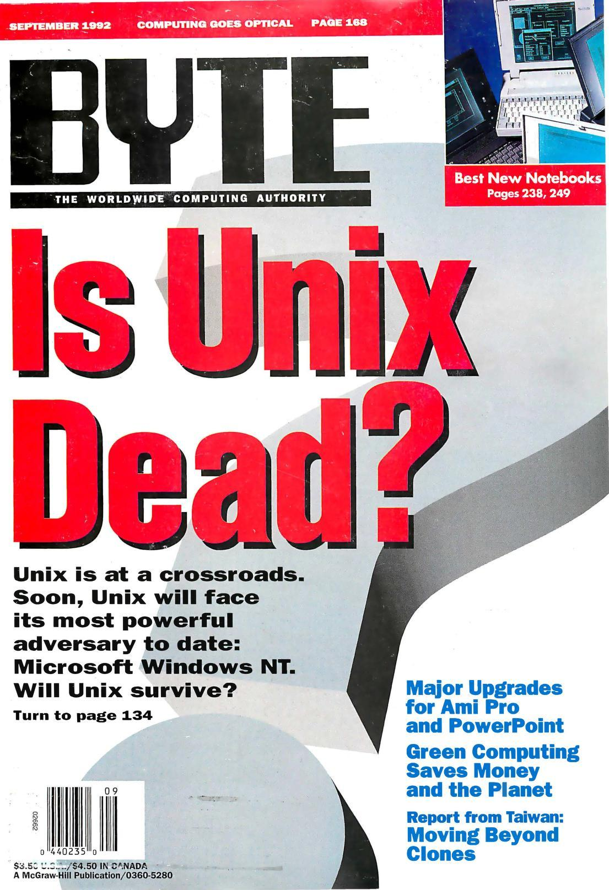

Windows NT (« New technology ») désigne la série de systèmes d'exploitation multitâche préemptif, multi-utilisateur, multiprocesseur, créés par Microsoft et ne reposant pas sur le système historique MS-DOS de Microsoft (contrairement à Windows 1.0, 2, 3.x, 95, 98 et Me). Il a permis à Microsoft et son partenaire Intel d'entrer sur le marché des serveurs.

La première version de Windows NT sort en 1993.

Windows NT deviendra ensuite Windows 2000 puis fusionnera avec les systèmes Windows historiques avec Windows XP et suivants.

---

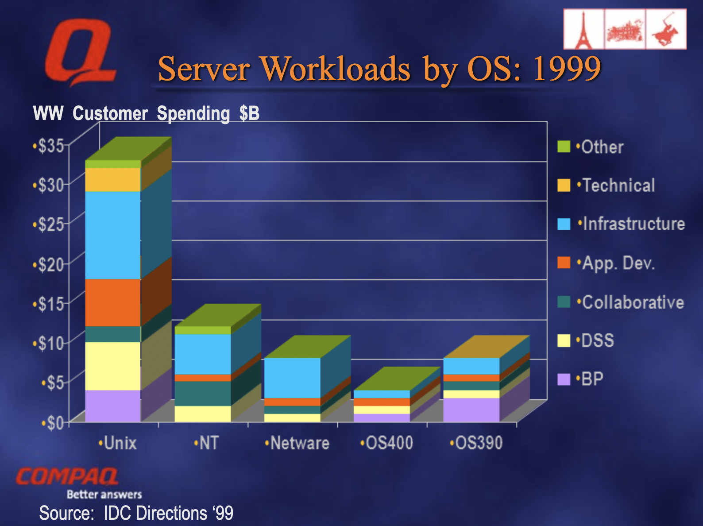

---

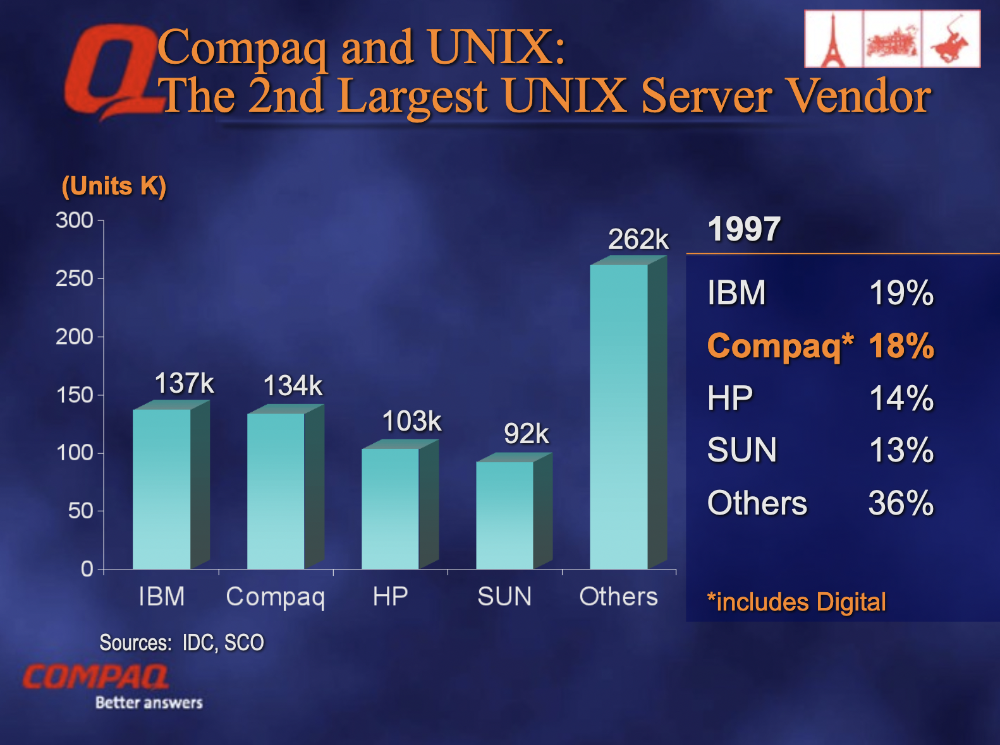

---


---

# Top 500 Supercomputers

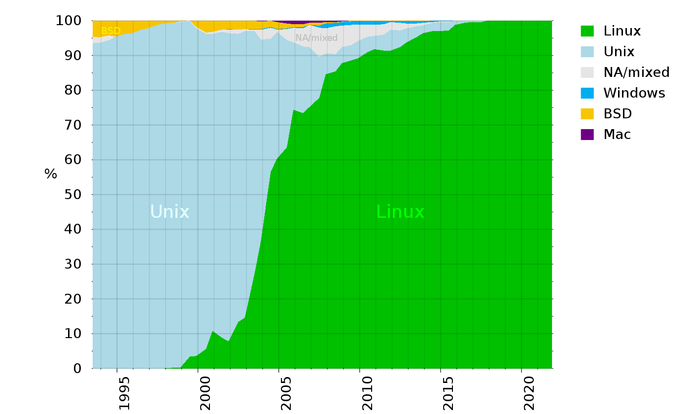

---

# Clients Web

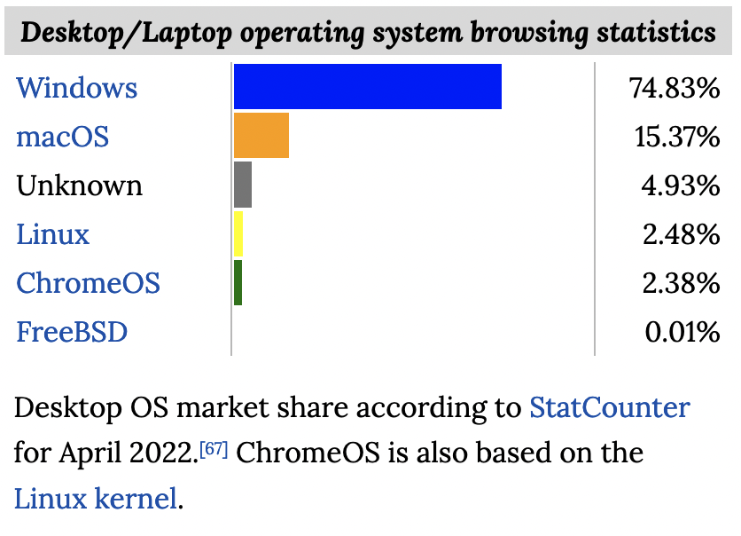 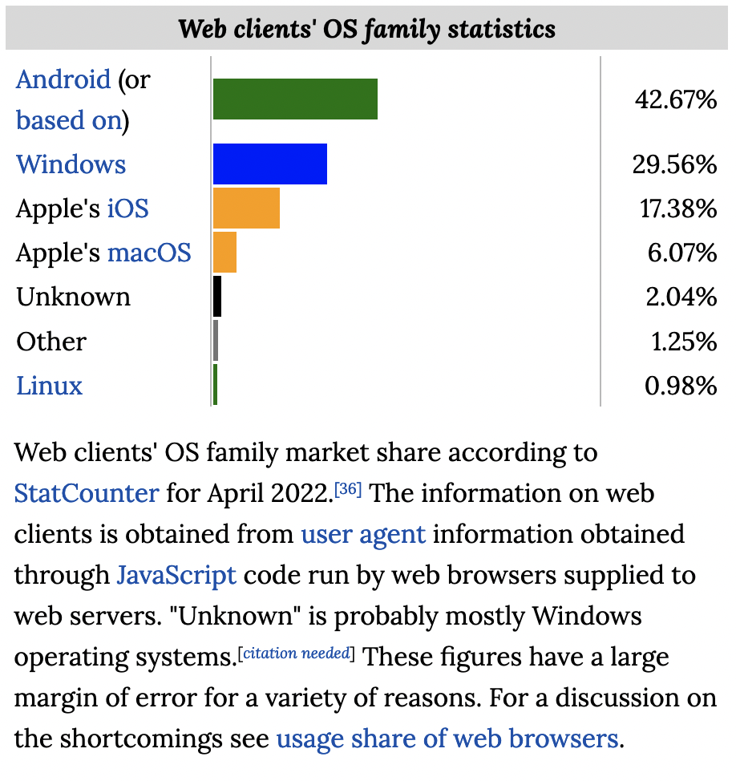

---

# Pour aller plus loin

- Peter Salus, "A quarter century of Unix" (1994)
- Rob Pike, "Unix History" (2018) <https://www.youtube.com/watch?v=_2NI6t2r_Hs>

---

# Interlude: la "philosophie Unix"

---

# Concepts clefs (70s)

1. Processus (et mémoire virtuelle)
2. Unification des périphériques/fichiers ("everything is a file")
3. Shell (et pipes)
4. Système de fichiers

= Concepts hérités de Multics (en grande partie), mais simplifiés. Multics cherchait à tout faire, à être trop polyvalent, trop flexible, et a échoué.
Vs. une des philosophies de base d'Unix était de "rester simple" ("KISS").

---

# Architecture d'origine (simplifiée)

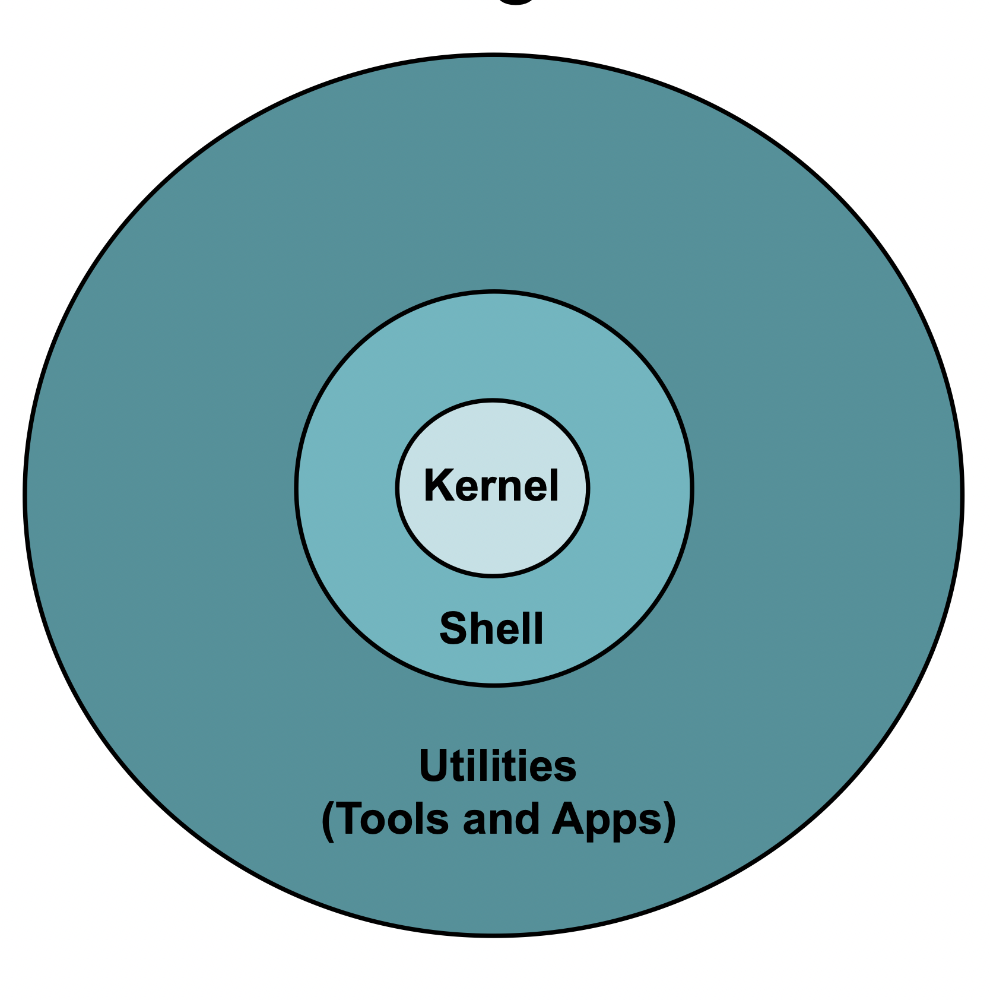

**Kernel** : Contrôle le système.
Tâches principales : gestion des processus / communication avec les périphériques / système de fichiers.

**Shell** : Interface utilisateur permettant de communiquer avec le système.
Comprend un ensemble d'utilitaires shell de base. Permet la création de scripts.

**Outils** : Le plus grand ensemble d'Unix.
Outils développés pour aider l'utilisateur dans ses tâches, par exemple: édition et traitement de texte, développement, communication (mail), etc .

---

# Architecture moderne (POSIX)

POSIX spécifie, dans dix-sept documents différents, les interfaces utilisateurs et les interfaces logicielles, la ligne de commande standard et l'interface de script qu'est le Bourne shell. Les autres commandes, services et utilitaires comprennent awk, echo, ed, et des centaines d'autres. Les services d'entrées/sorties de base (fichiers, terminaux, réseau) doivent être présents ; le système doit supporter certains attributs spécifiques pour les fichiers. POSIX définit aussi une interface de programmation standard, et celle-ci est prise en charge par la plupart des systèmes d'exploitation récents. 

---

# Unix/Posix (technical) history

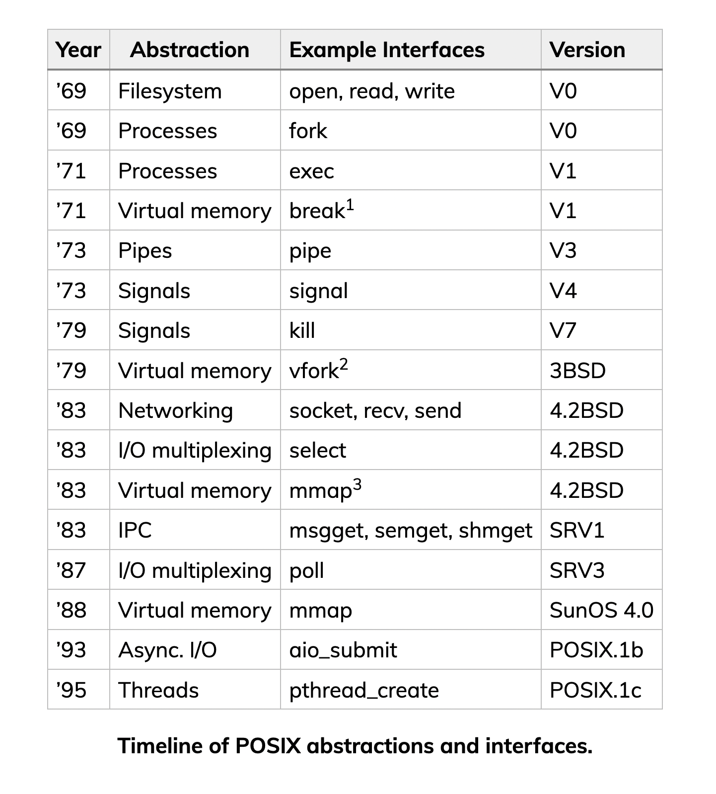

Source: Pekka Enberg, Ashwin Rao, Jon Crowcroft, Sasu Tarkoma, "Transcending POSIX: The End of an Era?" (2022)

---

# Outils de développement Unix

- Editeur: `ed`, `vi` (-> vim), Emacs (-> GNU Emacs)
- Compilateur(s): `cc`, autres
- `make`
- `diff` + `patch`
- Plus tard: GCC et outils associés, `m4`, Automake / Autoconf...

Lorsqu'un logiciel est diffusé sous forme de sources (et a été développé avec les outils GNU), l'installation se fait, souvent, par la séquence "`configure ; make ; make install`" ("CMMI")

---

# La culture Unix

- Unix a créé une culture
- Les gens voulaient un meilleur système informatique, plus efficace.
- Ces personnes étaient logiques et pragmatiques dans leur réflexion.
- Ils ont jeté les bases de : "La philosophie Unix"

---

# The invention of pipes (1973)

"And in their ensuing conversation, the historian establishes that this was the moment that truly gave birth to **the idea that Unix is a collection of tools**.

- Mahoney: Was the notion of toolbox there before pipes?
- McIlroy: No.
- Mahoney: Or did pipes create it?
- McIlroy: Pipes created it.
- Mahoney: Unix looked different after pipes?
- McIlroy: Yes, the philosophy that everybody started putting forth, “**This is the Unix philosophy. Write programs that do one thing and do it well. Write programs to work together. Write programs that handle text streams, because that is a universal interface**.” All of those ideas, which add up to the tool approach, might have been there in some unformed way prior to pipes, but they really they came in afterwards.""

---

# Doug McIlroy (1978)


- (i) Make each program do one thing well. To do a new job, build afresh rather than complicate old programs by adding new features.

- (ii) Expect the output of every program to become the input to another, as yet unknown, program. Don't clutter output with extraneous information. Avoid stringently columnar or binary input formats. Don't insist on interactive input.

- (iii) Design and build software, even operating systems, to be tried early, ideally within weeks. Don't hesitate to throw away the clumsy parts and rebuild them.

- (iv) Use tools in preference to unskilled help to lighten a programming task, even if you have to detour to build the tools and expect to throw some of them out after you've finished using them.

---

# Brian Kernighan

"Kernighan moved into his conclusion by asking what the technical legacy of Unix is. Some significant pieces of that legacy, including the hierarchical filesystem, use of high-level languages, and the programmable shell, have their origins in Multics. Others, including pipes, the whole tools concept, and regular expressions, are a direct result of the Unix work. And most importantly, he said, was that Unix brought a new philosophy on how to create software.

Almost all of this was in place by 1975 and, he said, it may well be true that there have been no great insights into operating-system design since. Certainly Unix has seen a lot of additions, including networking, multiprocessor support, graphical interfaces, Unicode, and more. But it's all built on the foundation created nearly 50 years ago."

---

# Cont.

"The creation of Unix was the result of an accidental combination of factors, starting with the juxtaposition of two exceptionally creative people "with good taste". Kernighan gave a lot of credit to "benign management" at Bell Labs that allowed this work to go forward, naming Doug McIlroy in particular. It was also spurred by the arrival of cheap hardware (in which category he included the $50,000 PDP-11 used to develop the system early on). But a key part was the Bell Labs working environment, which included stable funding and a long-term view, which is something that is hard to find today. 

Source: <https://lwn.net/Articles/881431/>

---

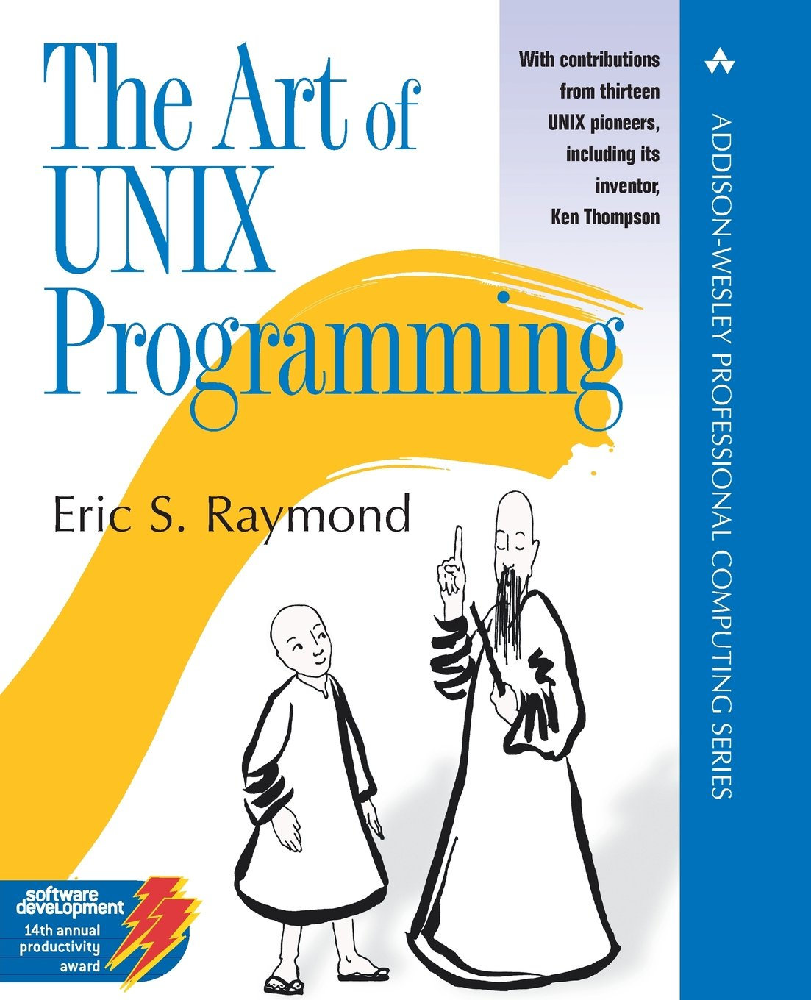

# Eric S. Raymond

- Rule of Modularity: Write simple parts connected by clean interfaces.
- Rule of Clarity: Clarity is better than cleverness.
- Rule of Composition: Design programs to be connected to other programs.
- Rule of Separation: Separate policy from mechanism; separate interfaces from engines.
- Rule of Simplicity: Design for simplicity; add complexity only where you must.
- Rule of Parsimony: Write a big program only when it is clear by demonstration that nothing else will do.
- Rule of Transparency: Design for visibility to make inspection and debugging easier.

----

# (cont.)

- Rule of Robustness: Robustness is the child of transparency and simplicity.
- Rule of Representation: Fold knowledge into data so program logic can be stupid and robust.
- Rule of Least Surprise: In interface design, always do the least surprising thing.
- Rule of Silence: When a program has nothing surprising to say, it should say nothing.
- Rule of Repair: When you must fail, fail noisily and as soon as possible.
- Rule of Economy: Programmer time is expensive; conserve it in preference to machine time.
- Rule of Generation: Avoid hand-hacking; write programs to write programs when you can.
- Rule of Optimization: Prototype before polishing. Get it working before you optimize it.
- Rule of Diversity: Distrust all claims for “one true way”.
- Rule of Extensibility: Design for the future, because it will be here sooner than you think.

---

# Rule of Modularity

Write simple parts connected by clean interfaces.
Software can be very complicated, especially for large systems.
Its even hard for the programming to cope with the complexity.
Take a modular approach and build many small, but simple components.
These components work together through simple and clean interfaces.

---

# Rule of Clarity

Clarity is better than cleverness.
Write code for humans to read, first!

---

# Rule of Composition

Design programs to be connected with other programs
THINK PIPE!
Stick with text streams for input and output.
Avoid the use of user input, use command line flags instead.
To make programs composable, make them independent. A program on one end of a text stream should care as little as possible about the program on the other end.

---

# Rule of Simplicity

Design for simplicity; add complexity only where you must.
The notion of “intricate and beautiful complexities” is almost an oxymoron.
Complexity leads to bugs.
Keep programs as simple as possible. Sometimes less is more.
“Worse” is “better”.
If other processing is required, consider writing another programming and exploiting composibility . . i.e. piping.

---

# Rule of Transparency

Design for visibility to make inspection and debugging easier.
Debugging dominates development. Unix is made to have programs work together.
Make it easy to understand how your program works (i.e. make it transparent).
For a program to demonstrate its own correctness, it needs to be using input and output formats sufficiently simple so that the proper relationship between valid input and correct output is easy to check.
A good ʻmanual pageʼ with examples also helps!

---

# Rule of Robustness

Robustness is the child of transparency and simplicity.
Program should work well. Minimize when it fails, and when it does fail, fail gracefully.
Consider situations, just as accepting empty lists/strings/etc., even in places where a human would seldom or never supply an empty string, avoids having to special-case such situations when generating the input mechanically.

---

# Rule of Least Surprise

In interface design, always do the least surprising thing.

The easiest programs to use are those that demand the least new learning from the user.
Stick with convention (+ means add).
Consider your audience.
Program used by sys administrators may have different common practices than a program used by programmers.
Avoid excessive features, novelty.

---

# Rule of Silence

When a program has nothing surprising to say, it should say nothing.

> "I think that the terseness of Unix programs is a central feature of the style. When your program's output becomes another's input, it should be easy to pick out the needed bits. And for people it is a human-factors necessity — important information should not be mixed in with verbosity about internal program behavior. If all displayed information is important, important information is easy to find."
-- Ken Arnold

---

# Rule of Repair
Repair what you can — but when you must fail, fail noisily and as soon as possible.

Basically, if it is something minor, fix it (or consider handling it), but if you “fail” then make sure you cause a detectable failure to the other programs.
Also, if possible, make it clear why it failed.

---

# Rule of Optimization

Prototype before polishing. Get it working before you optimize it.

“90% of the functionality delivered now is better than 100% of it delivered never!”
- Kernighan & Plauger ("The Elements of Programming Style", 1974)

“Premature optimization is the root of all evil”
– Donald Knuth (Computing “Grandfather”)

---

# discussion

- Qu'est-ce qui manque ?
- Les principes ci-dessus sont-ils universels ?
- Limitations de la "philosophie Unix" ?

---

# GUI

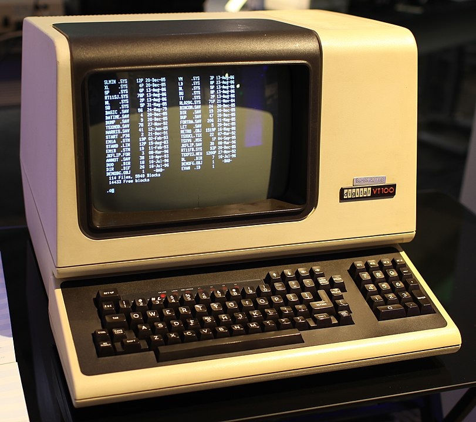 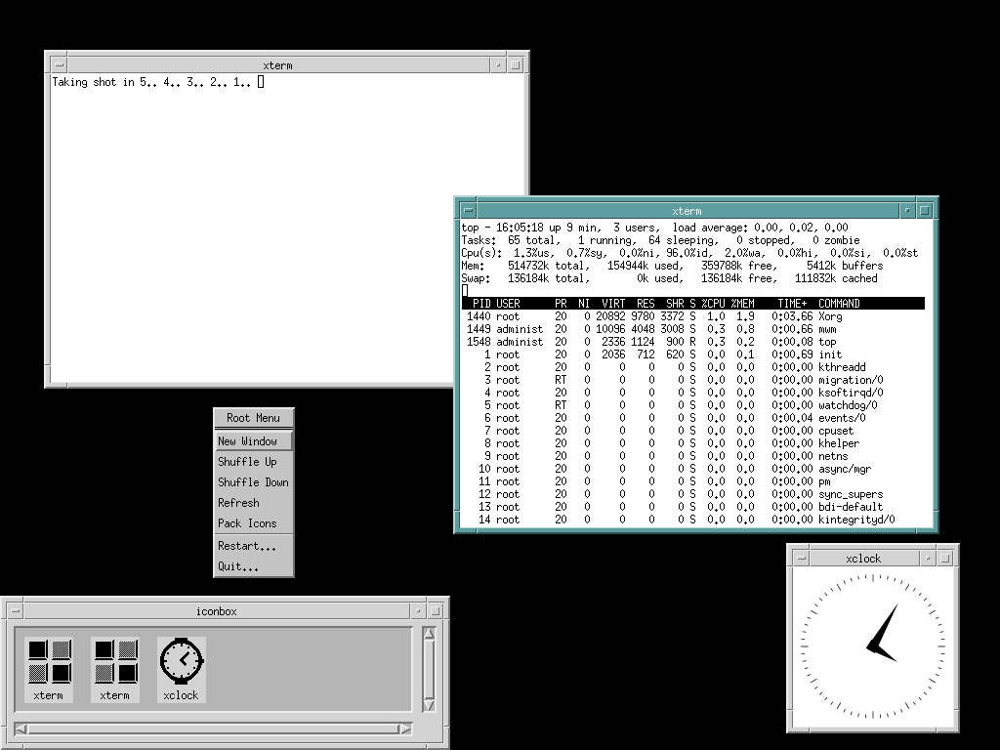

---

# Autres éléments de discussion

- Java - "Write once, run everywhere"
- Le Web
  - "Everything is a resource addressable by a URL"
  -  "[Netscape will soon reduce Windows to] a poorly debugged set of device drivers." (Marc Andreessen, 1995)
- Et plus généralement les systèmes distribués
- Les langages de script (Perl, Python...) comme alternative au Shell

Références:

- Rob Pike: The Good, the Bad, and the Ugly: The Unix Legacy (2001)
- Richard Gabriel: "Worse is better"
- ...

---

# Retour à la chronologie du libre

---

# Linus Benedict Torvalds

```
Newsgroups: comp.os.minix
From: torva...@klaava.Helsinki.FI (Linus Benedict Torvalds) Date: 25 Aug 91 20:57:08 GMT
Local: Sun 25 Aug 1991 21:57
Subject: What would you like to see most in minix?

Hello everybody out there using minix -

I’m doing a (free) operating system (just a hobby, won’t be big and professional like gnu) for
386(486) AT clones. This has been brewing since april, and is starting to get ready. I’d like any
feedback on things people like/dislike in minix, as my OS resembles it somewhat (same physical
layout of the file-system (due to practical reasons) among other things).

I’ve currently ported bash(1.08) and gcc(1.40), and things seem to work. This implies that I’ll get
something practical within a few months, and I’d like to know what features most people would want.
Any suggestions are welcome, but I won’t promise I’ll implement them :-)

Linus (torva...@kruuna.helsinki.fi)

PS. Yes - it’s free of any minix code, and it has a multi-threaded fs. It is NOT protable (uses 386
task switching etc), and it probably never will support anything other than AT-harddisks, as that’s
all I have :-(.
```

---


# RMS et l'imprimante Xerox 9700

---


## Pourquoi est-ce plus que jamais d'actualité ? ->

---

# Les début de la FSF et du projet GNU

- 1971: RMS arrive au MIT (AI lab)
- 1980: le mythe fondateur de l'imprimante
- 1981: Symbolics embauche presque tous les hackers du MIT
- 1984: Stallman quitte le MIT pour diriger le projet GNU (www.gnu.org), annoncé en septembre 1983
- 1985: création de la [Free Software Foundation](https://www.fsf.org), publication du "[GNU Manifesto](http://www.gnu.org/gnu/manifesto.html)"
- 1989 : première version de la licence GPL (General Public Licence), avec l’aide de Eben Moeglen

---

# 1985 - X Window System

Aux environs de 1985, le “X Consortium”, basé au MIT, crée et distribue le “X Window System”.

```
From: rws@mit-bold (Robert W. Scheifler) To: window@athena
Subject: window system X
Date: 19 Jun 1984 0907-EDT (Tuesday)

I’ve spent the last couple weeks writing a window system for the VS100. I stole a fair amount of
code from W, surrounded it with an asynchronous rather than a synchronous interface, and called it
X. Overall performance appears to be about twice that of W. The code seems fairly solid at this
point, although there are still some deficiencies to be fixed up.

There is no documentation yet; anyone crazy enough to volunteer? I may get around to it eventually.

Anyone interested in seeing a demo can drop by NE43-531, although you may want to call 3-1945 first.
Anyone who wants the code can come by with a tape. Anyone interested in hacking deficiencies, feel
free to get in touch.
```

---

# Licence de X Window System

Il s’agit d’un “logiciel libre” avec une licence très permissive.

*The MIT License Copyright (c) . . .*

*Permission is hereby granted, free of charge, to any person obtaining a copy of this software and associated documentation files (the "Software"), to deal in the Software without restriction, including without limitation the rights to use, copy, modify, merge, publish, distribute, sublicense, and/or sell copies of the Software, and to permit persons to whom the Software is furnished to do so, subject to the following conditions:*

*The above copyright notice and this permission notice shall be included in all copies or substantial portions of the Software.*

---

# Toutes les pièces du puzzle sont en place

- GUI: X est disponible, entiérement libre
- Noyau: Linux est en plein dévéloppement
- OS: les outils *user space* GNU (compilateur, textutils) et BSD sont prêts
- Réseau: la pile TCP/IP est généralisée dans le réseau recherche, le débit monte
- Web: ftp est généralisé, WAIS montre des idées, WorldWideWeb.app existe
- Matériel: du matériel qui embarque le nécessaire pour des vrais OS se popularise (80386, 68030, processeurs RISC)
- Licences: la licence GPL commence à se repandre
- Manifesto: le GNU Manifesto fournit une première base philosophique pour le Logiciel Libre

---

# Quelques dates

1989: Cygnus, première entreprise qui offre du support pour GNU
1991: Linux 0.11: premiére version “autonome” (pour 386)
1992: 386BSD 0.1 par William et Lynne Jolitz
1992: US Air Force paye New York University (NYU) pour une suite Ada 95, sous licence GPL. NYU crée GNAT (GNU NYU Ada 95 Translator) avec GCC
1992: distributions Slackware (Patrick Volkerding), S.u.S.E. en Allemagne
1993: Ian Murdock crée Debian, et son “social contract”
1993: FreeBSD 1.0 pour 386
1994: Fondation de Ada Core Technologies (ACT), qui vit du support de GNAT, pas des licences
1994: Marc Ewing crée Red Hat

---

# Interlude: les distributions

- Une distribution Linux est un ensemble cohérent de logiciels, la plupart étant des logiciels libres, assemblés autour du noyau Linux, et formant un système d'exploitation pleinement opérationnel.
- Les plus populaires en 2022 semblent être: Debian, Ubuntu (dérivée de Debian), Linux Mint (idem), Fedora (base de Red Hat Enterprise Linux, et CentOS), Gentoo, OpenSUSE (base de SUSE Linux Enterprise), Alpine Linux (pour les containers)...

---

# Anatomie d'une distribution

Une distribution comprend *a minima*:

- Un installeur / configurateur
- Un système de paquets, incluant notamment des outils de build et d'installation
- Des milliers de paquets, dérivés (en général) de logiciels libres "upstream"
- Des processus de développement et de maintenance

---

# Quelques dates

1994: Linux Journal.
1994: NetBSD 1.0
1995: FreeBSD 2.0
1995: Première version (0.6.2) d’Apache distribuée.
1996: KDE est lancé (Matthias Ettrich)
1997: OpenBSD, fork de NetBSD par Theo de Raadt
1997: Eric S. Raymond : “The Cathedral and the Bazaar”
1997: GNOME est lancé (à cause des problèmes de la licence de Qt, base de KDE)

---

# 1998 - L'année où tout bascule

Jan. 1998: Netscape annonce le passage de Navigator en libre 
Fev. 1998: Peterson, Raymond, etc. créent le terme “open source”
Mar. 1998: Netscape ouvre le code
Mar. 1998: fondation de l'AFUL en France
Jul. 1998: Debian 2.0: 300 contributeurs, 1,500 paquets
Jul. 1998: KDE 1.0 sort
Jul. 1998: Linux Mandrake (Gael Duval)
Aou. 1998: Linus Torvalds fait la couverture de Forbes Magazine
Oct. 1998: IBM porte Apache sur les AS/400
Oct. 1998: Intel et Netscape investissent dans Red Hat
Nov. 1998: “Halloween” documents

---

# [fit] \(Interlude) Emergence de l'expression "open source"

---

# Contexte et motivations

L'expression « open source » est apparue en 1998, lors d'une réunion tenue à Palo Alto, en Californie, en réaction à l'annonce faite par Netscape en janvier 1998 de la publication du code source de Navigator.

Linus Torvalds a apporté son soutien le lendemain, et Phil Hughes a soutenu le terme dans le Linux Journal. Richard Stallman, le fondateur du mouvement du logiciel libre, semblait initialement adopter le terme, mais a ensuite changé d'avis.

Parmi les motivations: «free» possède deux significations en anglais, «libre» (au sens de «liberté») et «gratuit». Cette nouvelle désignation permet de rappeler aux utilisateurs qu'un logiciel a un coût. Il s'agit également de choisir un vocabulaire correspondant mieux au monde des affaires, le terme «free» (gratuit) de free software risquant d'inquiéter les entreprises.

---

# [fit]1997 Les principes du logiciel libre selon Debian (DFSG)

[.build-lists: false]

1. Redistribution libre et gratuite.
2. Code source.
3. Applications dérivées.
4. Intégrité du code source de l'auteur.
5. Aucune discrimination de personne ou de groupe.
6. Aucune discrimination de champ d'application.
7. Distribution de licence.
8. La licence ne doit pas être spécifique à Debian.
9. La licence ne doit pas contaminer d'autres logiciels.
10. Exemples de licence (-> GPL, MIT, Artistic)

Source: <https://www.debian.org/social_contract.fr.html>

---

# 1999 La définition de l'OSI

[.build-lists: false]

1. Redistribution libre
2. Code source
3. Travaux dérivés
4. Intégrité du code source de l'auteur
5. Pas de discrimination contre les personnes ou les groupes
6. Absence de discrimination dans les domaines de compétence
7. Distribution de la licence
8. La licence ne doit pas être spécifique à un produit
9. La licence ne doit pas restreindre d'autres logiciels
10. La licence doit être neutre sur le plan technologique

Source: <https://opensource.org/osd>

---

# Positionnement !=

> “Open source is a development method for software that harnesses the power of distributed peer review and transparency of process. The promise of open source is better quality, higher reliability, more flexibility, lower cost, and an end to predatory vendor lock-in.” -- OSI
<br>
> "Open source *is* free software. Open source started as a marketing program for free software back in 1998." -- Simon Phipps – President of OSI (2018)

---

# Crédits

- Photos: en général, viennent de Wikipedia.
- Captures d'écrans: viennent de leurs sites respectifs.
- Textes: originaux (copyright Stefane Fermigier, 2022 - licence: CC BY SA) ou dérivés de cours similaires publiés par les Pr. Di Cosmo, Riehle, Zacchiroli, sous licences permettant la réutilisation et/ou avec l'accord des intéressés.

- Slides disponibles ici: <https://github.com/sfermigier/mineure-oss-epita>
