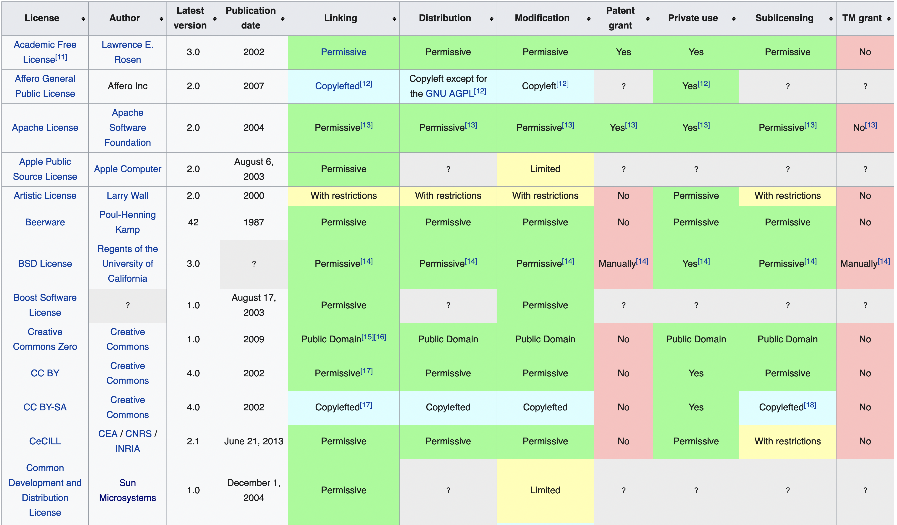
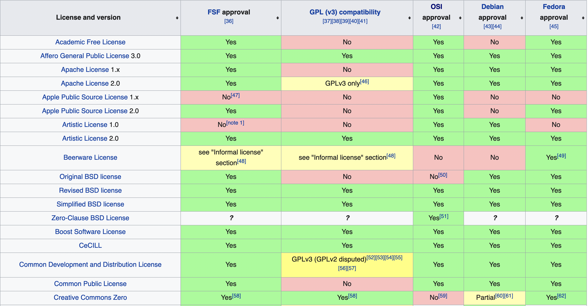
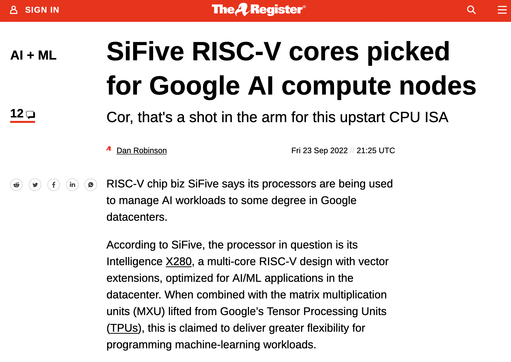
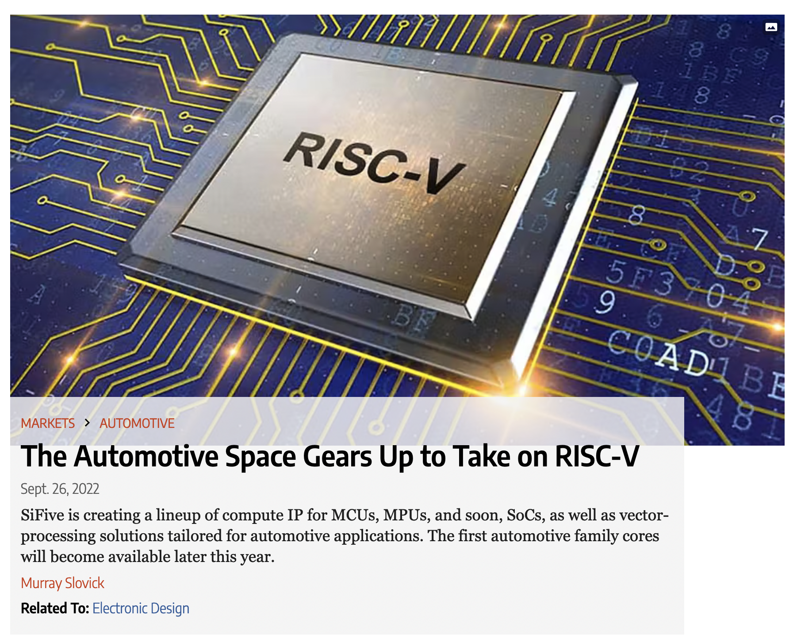
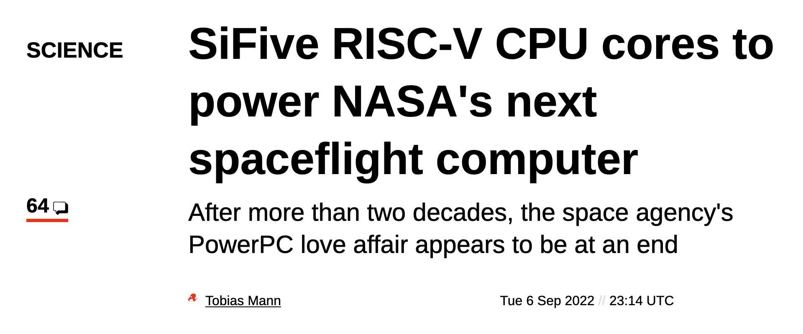
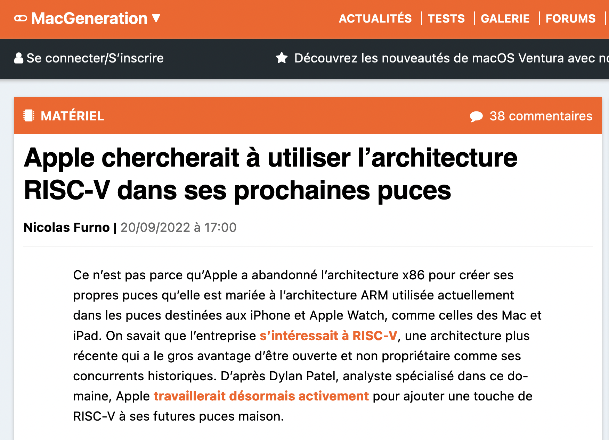

autoscale: true
slidenumbers: true
build-lists: true
slide-transition: true

# Mineure OSS @ EPITA
## Session 3

---

# Dernières sessions

- Unix et sa "philosophie"
- Emergence du libre et de Linux
- Définitions du logiciel libre et de l'open source

---

# Plan de la session

- Errata et compléments
- Histoire (suite et fin)
- Texte(s) fondateur(s)
- Economie du logiciel

---

# Errata et compléments

- Sun = "Stanford University Network"
- LiSP
- Oubli de parler du "GNU Manifesto"

---

# LiSP @ FSF

- Emacs-Lisp
- GCL (GNU Common Lisp) - dernière release en 2014
- Guile (1993-...)
- Guix (2013-...) and Guix System

---

# GNU Manifesto (~1983)

"GNU, which stands for Gnu's Not Unix, is the name for the complete Unix-compatible software system which I am writing so that I can give it away free to everyone who can use it [1]. Several other volunteers are helping me. Contributions of time, money, programs and equipment are greatly needed."

"GNU will be able to run Unix programs, but will not be identical to Unix." "Unix is not my ideal system, but it is not too bad."

"I consider that the Golden Rule requires that if I like a program I must share it with other people who like it."

"GNU is not in the public domain. Everyone will be permitted to modify and redistribute GNU, but no distributor will be allowed to restrict its further redistribution."

"I have found many other programmers who are excited about GNU and want to help."

---

# The Open Source Definition

**Introduction**
Open source doesn't just mean access to the source code. The distribution terms of open-source software must comply with the following criteria:

**1. Free Redistribution**
The license shall not restrict any party from selling or giving away the software as a component of an aggregate software distribution containing programs from several different sources. The license shall not require a royalty or other fee for such sale.

**2. Source Code**
The program must include source code, and must allow distribution in source code as well as compiled form. Where some form of a product is not distributed with source code, there must be a well-publicized means of obtaining the source code for no more than a reasonable reproduction cost, preferably downloading via the Internet without charge. The source code must be the preferred form in which a programmer would modify the program. Deliberately obfuscated source code is not allowed. Intermediate forms such as the output of a preprocessor or translator are not allowed.

---

# The Open Source Definition

**3. Derived Works**
The license must allow modifications and derived works, and must allow them to be distributed under the same terms as the license of the original software.

**4. Integrity of The Author's Source Code**
The license may restrict source-code from being distributed in modified form only if the license allows the distribution of "patch files" with the source code for the purpose of modifying the program at build time. The license must explicitly permit distribution of software built from modified source code. The license may require derived works to carry a different name or version number from the original software.

---

# The Open Source Definition

**5. No Discrimination Against Persons or Groups**
The license must not discriminate against any person or group of persons.

**6. No Discrimination Against Fields of Endeavor**
The license must not restrict anyone from making use of the program in a specific field of endeavor. For example, it may not restrict the program from being used in a business, or from being used for genetic research.

**7. Distribution of License**
The rights attached to the program must apply to all to whom the program is redistributed without the need for execution of an additional license by those parties.

---

# The Open Source Definition

**8. License Must Not Be Specific to a Product**
The rights attached to the program must not depend on the program's being part of a particular software distribution. If the program is extracted from that distribution and used or distributed within the terms of the program's license, all parties to whom the program is redistributed should have the same rights as those that are granted in conjunction with the original software distribution.

**9. License Must Not Restrict Other Software**
The license must not place restrictions on other software that is distributed along with the licensed software. For example, the license must not insist that all other programs distributed on the same medium must be open-source software.

**10. License Must Be Technology-Neutral**
No provision of the license may be predicated on any individual technology or style of interface.

---

# Licences reconnues par l'OSI vs. FSF

OSI: 
- https://opensource.org/licenses/alphabetical
- 117 licences

FSF:
- https://www.gnu.org/licenses/license-list.html
- ~98 licences

---



---



---

# -> Les grandes controverses du libre

- "Free Software" vs. "Open Source"
- Idéologie vs. pragmatisme
- Noyau monolithique vs. micronoyau
- "Linux" vs. "GNU/Linux"
- GPL vs licences "permissives"
- Faut-il faire évoluer les définitions (FSF et OSI) pour prendre en compte certaines dimensions éthiques ? Pour éviter les abus des géants du cloud ?
- GNOME vs. KDE
- Le libre vs. le cloud
- Inclusivité des communautés
- ...

---

# Business timeline (des haut et des bas)

1999: fondation de MandrakeSoft, qui deviendra Mandriva en 2005 et fermera en 2015
1999: Marc Fleury démarre EJB-OSS, serveur J2EE qui deviendra JBoss
1999: IPO de Red Hat et de VA Linux
2000: IBM “investit” 1 Mrd de dollars dans Linux
2004: fondation de Canonical (Ubuntu)
2006: rachat de JBoss par Red Hat pour 350 M de $
2007: Java devient open source (*with strings attached*)
2008: rachat de MySQL par Sun pour 1 Mrd de $
2009: proche de la faillite, Sun Microsystems est racheté par Oracle
2017: rachat de GitHub par Microsoft pour 7 Mrd de $
2017: IPO de Mongodb (1.2 Mrds de $)
2019: rachat de Red Hat par IBM pour 34 Mrds de $
2021: IPO de Gitlab (15 Mrds de $ de capitalisation)

<!-- ---

# Virtualisation & Cloud

- 2001: Linux-VServer
- 2003: Xen, Qemu
- 2005: OpenVZ
- 2007: KVM
- 2010: OpenStack
- 2013: Docker -->

---

# Développement collaboratif

[.column]
- 1990: CVS (Concurrent Versions System) sous licence GPL
- 1999: Sourceforge.net (par VA Linux), code source -> Apache Allura en 2013
- 2000: Subversion (-> Apache Subversion en 2010)
- 2000: BerliOS (fermé en 2014)
- 2004: Trac (Edgewall Software)
- 2005: Git (Linus Torvalds) et Mercurial (Matt Mackall -> Olivia Mackall)

[.column]
- 2006: Google Code (fermé en 2016) 
- 2006: Redmine (Jean-Philippe Lang)
- 2008: Bitbucket et GitHub (propriétaires)
- 2010: Phabricator (Faebook)
- 2011: Gitlab (licence MIT + propriétaire)
- 2017: rachat de GitHub par Microsoft pour 7 Mrd de $
- 2019: Sourcehut (Drew DeVault)
- 2021: IPO de Gitlab

---

# Les textes fondateurs

(Attention: sélection personnelle)

- 1985: "The GNU Manifesto" (RMS)
- 1984: "Hackers: Heroes of the Computer Revolution" (S. Levy)
- 1997: "The Cathedral and the Bazaar" (E. S. Raymond)
- 1997: "Linux, mini OS contre maxi exploitation" (JC Guédon et B. Lang)
- 1998: "Piège dans le cyberespace" (R. Di Cosmo) et "Le Hold-Up planétaire" (R. Di Cosmo et D. Nora)
- 1999: "Open sources - voices of the open source revolution" (mutiples auteurs)

---

# Les grandes fondations

1985: FSF
1997: KDE e.V.
1999: Apache Foundation
2000: Linux Foundation (fusion de l'Open Source Development Labs du Free Standards Group)
2001: FSFE
2001: Python Software Foundation
2004: Eclipse Foundation
2007: OW2 (Fusion de ObjectWeb et OrientWare)
2010: Document Foundation (LibreOffice)

---

# Associations françaises

1996: APRIL
1998: AFUL
1998-1999: premiers LUGs (Parinux, GUILDE, ABUL...)
1998: Linuxfr
2001: Framasoft (2004 pour l'association)
2002: ADULLACT
2010: CNLL

---

# Manifestations notables

1998: "Linux Party" nationale
1999: Linux Expo Paris qui s'appelera ensuite Solutions Linux
2000: premières RMLL (Rencontres Mondiales du Logiciel Libre)
2001: OSDEM puis FOSDEM à Bruxelles
2008: Open World Forum / Forum Mondial du Libre
2015: OWF et Solution Linux fusionnent pour devenir le POSS (Paris Open Source Summit)
2021: le POSS devient l'OSXP (Open Source Experience)

---

# Langages de programmation "libres"

[.build-lists: false]

- 1987: Perl
- 1991: Python
- 1994: PHP
- 1995: Ruby
- 2009: Go
- 2010: Rust
- 2015: Zig

---

# Pop quizz

- Comment sont développés ces langages ?
- Qu'est-ce qui manque dans cette liste ? Pourquoi ? Est-ce justifié ?

---

# Aux plans législatif, réglementaire et parlementaire

- 1999: proposition de loi Laffite ("tendant à généraliser dans l'administration l'usage d'Internet et de logiciels libres")
- 2000: proposition de loi Le Déault, Paul, Cohen
- 2012: circulaire Ayrault
- 2013: loi ESR
- 2016: loi République Numérique
- 2020: rapport Bothorel puis circulaire Castex
- 2021: rapport Latombe

---

# Au plan judiciaire

- 2003-2010: affaire SCO v. Novell
- Depuis 2004: gpl-violations.org (Harald Welte)
- 2006: Gerby v. Darty, aka "Racketiciel", dénonciation de la vente liée [(site)](https://non.aux.racketiciels.info/)
- 2008: Free assigné en justice pour violation de la GPL, finit par publier ses patches en 2011.
- 2010: Oracle v. Google
- 2015: CNLL v. Ministère de l'Education Nationale ("Edunathon")

---

# Pop quiz

- Linux a-t-il "gagné" ?
  - Si oui, contre qui ? Et selon quels critères de "victoire" ?
  - Si oui, pourquoi ?
- L'open source a-t-il gagné ? Le libre ?
  - Même questions

---

# Open Hardware

---

# 2010 - RISC-V


RISC-V (« RISC five ») est une architecture de jeu d'instructions (*instruction set architecture* ou ISA) RISC ouverte et libre, disponible en versions 32, 64 et 128 bits. Ses spécifications sont ouvertes et peuvent être utilisées librement par l'enseignement, la recherche et l'industrie. Les specifications sont ratifiées de façon ouverte par la communauté internationale des développeurs.

Il en existe des implémentations libres (et d'autres non).

---

 

 

---

# 2011 - Open Compute Project (OCP)


La fondation Open Compute Project (OCP) a été créée en 2011 avec pour mission d'appliquer les avantages de l'open source et de la collaboration ouverte au matériel et d'augmenter rapidement le rythme de l'innovation dans, près et autour des équipements de réseau des centres de données, des serveurs polyvalents et GPU, des dispositifs et appareils de stockage et des conceptions de rack évolutives. Le modèle de collaboration de l'OCP est appliqué au-delà du centre de données, contribuant à faire progresser l'industrie des télécommunications.

Les principales avancées concernent l'efficacité énergétique des systèmes déployés, mais aussi le développement de briques open source.

Facebook a par exemple annoncé avoir économisé 2 milliards de dollars sur ses coûts d'infrastructure en trois ans grâce à ce projet.

---

# "TD" - Lecture du *Debian Social Contract*

---

# Lecture du *Debian Social Contract*

Source: <https://www.debian.org/social_contract>

Grandes lignes:

1. Debian will remain 100% free
2. We will give back to the free software community
3. We will not hide problems
4. Our priorities are our users and free software
5. Works that do not meet our free software standards

---


---

# Origine

```
To: debian-announce@lists.debian.org
Subject: Debian's "Social Contract" with the Free Software Community
From: bruce@debian.org (Bruce Perens)
Date: Fri, 4 Jul 97 22:32 PDT
Message-id: <[🔎] m0wkNSr-00IS1iC@debian.org>
Reply-to: Bruce Perens <bruce@debian.org>

[...]

The concept of a Linux distribution stating its "social contract with
the free software community" was suggested to me by Ean Schussler. I
composed a draft, and then it was refined by the Debian developers in
e-mail confernce during most of June. They then voted to approve it as
our publicly stated policy. We hope that other software projects,
including other Linux distributions, will use this document as a model.
We will gladly grant permission for any such use.
```

---

# Questions

- En quoi ces principes sont importants ? Quelles conséquences opérationnelles ?
- Sont-ils suffisants ?
- Ces principes sont-ils transposables à d'autres projets ? A une entreprise ?
- Pourquoi la FSF n'approuve pas ce texte ?

---

# Eléments de réponse

---

# Commentaires de la FSF

"Debian's Social Contract states the goal of making Debian entirely free software, and Debian conscientiously keeps nonfree software out of the official Debian system. However, Debian also maintains a repository of nonfree software. According to the project, this software is “not part of the Debian system,” but the repository is hosted on many of the project's main servers, and people can readily find these nonfree packages by browsing Debian's online package database and its wiki.

There is also a “contrib” repository; its packages are free, but some of them exist to load separately distributed proprietary programs. This too is not thoroughly separated from the main Debian distribution.

Debian is the only common non-endorsed distribution to keep nonfree blobs out of its main distribution. However, the problem partly remains. The nonfree firmware files live in Debian's nonfree repository, which is referenced in the documentation on debian.org, and the installer in some cases recommends them for the peripherals on the machine.

In addition, some of the free programs that are officially part of Debian invite the user to install some nonfree programs. Specifically, the Debian versions of Firefox and Chromium suggest nonfree plug-ins to install into them.

Debian's wiki also includes pages about installing nonfree firmware."

---

# Réaction de Bob Young

"The idea of the DSC was first proposed by Ean Schuessler after a conversation with Bob Young, co-founder of Red Hat. Schuessler said Red Hat should issue a set of guidelines that would guarantee to the community as the company expanded it would always be committed to the ideals of Free Software. Young said this would be a "kiss of death" for Red Hat, implying it would constrain the company's ability to generate profit. Concerned about Young's response, Schuessler and other Debian developers decided to broach the idea of a "social contract" that would supplement Debian's initial manifesto written by Ian Murdock."

---

# Commentaires de E. Gabriella Coleman (2005)

"Developers continually draw on these texts to craft a dense ethical practice that sustains itself primarily via ongoing acts of narrative interpretation."

"By “ethical enculturation,” I refer to a process of relatively conflict-free socialization. Among developers, this includes learning the tacit and explicit knowledge (such as technical, moral, or procedural knowledge) needed to effectively interact with other members of a project, as well as acquiring trust, learning appropriate social behavior, and establishing “best practices.”"

---

# Commentaires de E. Gabriella Coleman (2005)

"While not all developers are equally invested in the legal discussion of F/OSS, a basic understanding of normative IP law and F/OSS legal convention is required on a functional basis in order to participate in Debian."

"The third ethical moment I investigate is crisis. As the number of developers in the Debian project has grown from one dozen to nearly one thousand, punctuated crises routinely emerge around particularly contested issues. [...] Many of these crises have an acute phase in which debate erupts on several media all at once: mailing lists, IRC conversation, and blog entries. While the debate during these periods can be congenial, measured, rational, and sometimes peppered with jokes, its tone can also be passionate and uncharitable, sometimes downright vicious. During these moments, we find that while developers may share a common ethical ground, they often disagree about the implementation of its principles. "

---

# Crédits

- Photos: en général, viennent de Wikipedia.
- Captures d'écrans: viennent de leurs sites respectifs.
- Textes: originaux (copyright Stefane Fermigier, 2022 - licence: CC BY SA) ou dérivés de cours similaires publiés par les Pr. Di Cosmo, Riehle, Zacchiroli, sous licences permettant la réutilisation et/ou avec l'accord des intéressés.

- Slides disponibles ici: <https://github.com/sfermigier/mineure-oss-epita>
