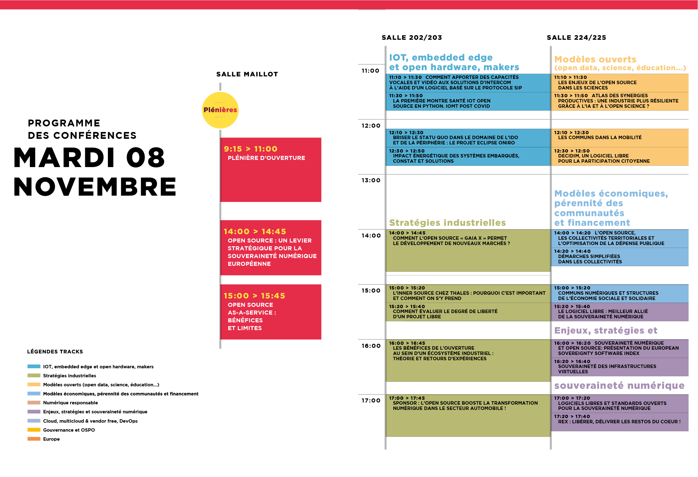
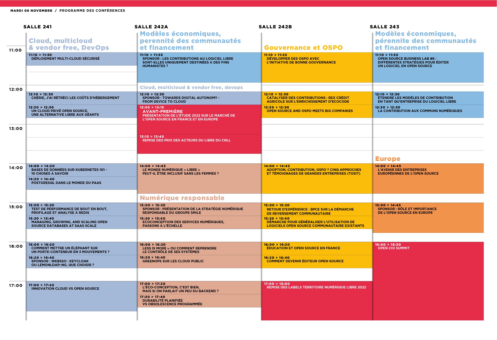
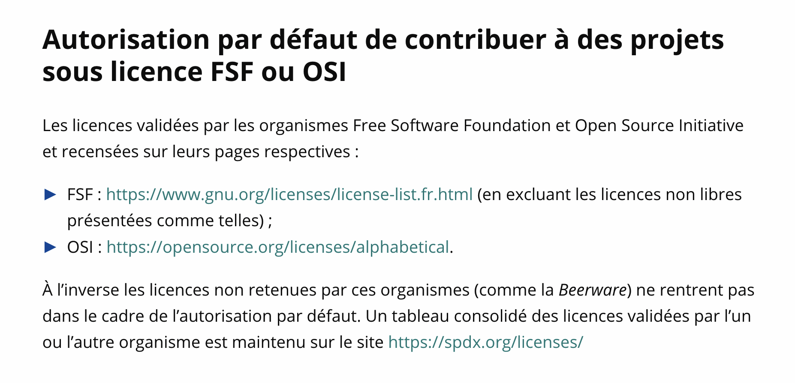
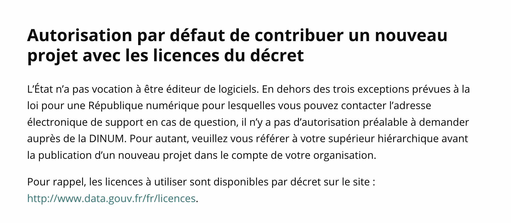
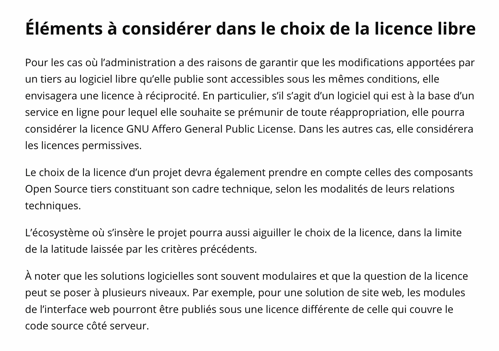
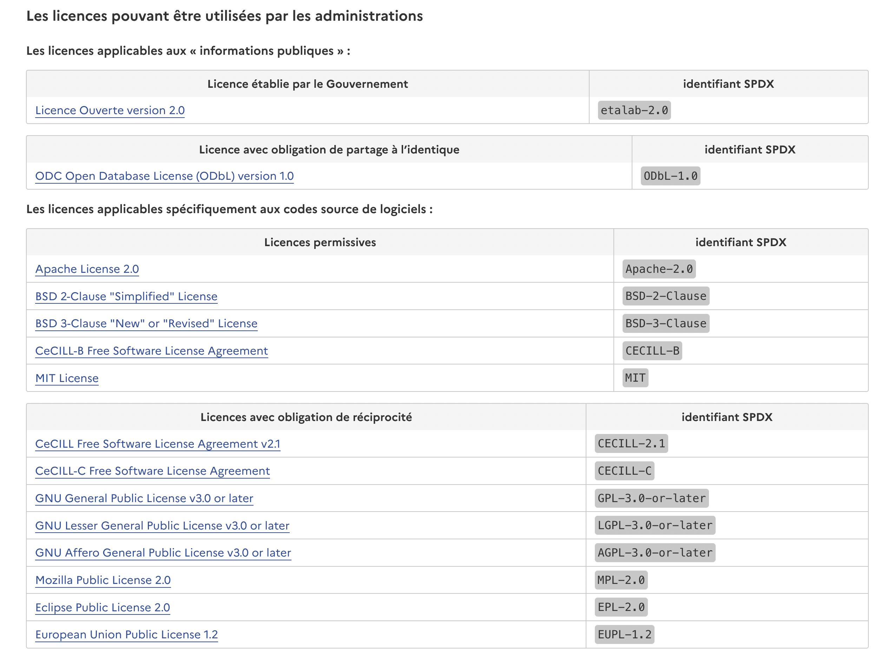

autoscale: true
slidenumbers: true
build-lists: true
slide-transition: true

# Mineure OSS @ EPITA
## Session 6

---

# Cette session

- Préparation visite OSXP
- Licences du logiciel libre (suites et fin)
- Comment animer un projet de logiciel libre (deck 6.5)

---

# Les conférences open source

---

# Qu'est-ce qu'une conférence ?

- Un événement, localisé dans le temps et l'espace, où des personnes se réunissent pour échanger sur un sujet donné.

- Un (ou plusieurs) organisateurs qui préparent l'événement, s'occupent de la communication, de la logistique, la commercialisation, etc.

- Business de plateforme triface:

  - Visiteurs (participants)
  - Speakers (intervenants)
  - Sponsors / exposants

---

# Typologie

- Modèle économique
  - Profit / non profit / hybrid
  - Modèle de revenu (payant / gratuit, mais pour qui ?)
- Conférence / Workshop / Salon / Rencontre d'affaires...
- Généralistes / spécifiques (sur 1 métier, 1 techno, 1 domaine, 1 produit...)
- Standalone / dans un événement plus large ("embedded")
- Audiences (regionale, nationale, internationale)
- Lieu (fixe / tournant / en ligne / hybride)
- Typoologie des speakers (pros/amateurs, stars/anonymes, payés/défrayés/pas payés/payants)
- Cas des formations ?

---

# OSXP

- 1998: "village open source" au milieu du salon "Interop"
- 1998-2005: Linux Expo
- 2006-2010: Solutions Linux
- 2010-2014: Open World Forum (OWF)
- 2015-2019: Paris Open Source Summit
- 2021-...: Open Source Experience (OSXP)

---

# "Mission OSXP"

- Participe de l'évaluation de la mineure OSS (35% de la note finale)
- Prévoir une visite de l'OSXP le 8 novembre (ou à un autre moment)
- A minima:
  - Visiter le salon
  - Assister à 3 talks (minimum), au choix
- Restitution par écrit (15 nov. -> sf@fermigier.com)
  - "Rapport d'étonnement" (1 page)
      - "Gap analysis" (la réalité du salon vs. les concepts vus en cours)
  - CR synthétique de 3 talks (mini):
      - Modèle: <https://reinout.vanrees.org/weblog/2022/06/16/rotterdam-meetup.html> et autres (<https://reinout.vanrees.org/weblog/tags/python.html>)

---

---

---

# Retour aux licences

---

# Historique des principales licences libres

OSI: "The following OSI-approved licenses are popular, widely used, or have strong communities:"

[.column]
- 1987: MIT
- 1988: (proto-)BSD
- 1989: GPL v1
- 1990: BSD "4-clause"
- 1991: GPL v2, LGPL ("v2")
- 1998: Mozilla Public License 1.0

[.column]
- 1999: BSD "3-clause" et "2-clause"
- 2004: Apache 2.0
- 2004: CDDL
- 2007: GPL v3, LGPL v2.1
- 2012: Mozilla Public License 2.0
- 2017: Eclipse Public License 2.0

---

# Les points clefs

---

---

---

---

---

---

---

---

---

---

---

---

---

---

# Shims ?

"Cales" en francais. Aussi appelés "wrappers", "proxies", "adapters", etc.

"In computer programming, a shim is a library that transparently intercepts API calls and changes the arguments passed, handles the operation itself or redirects the operation elsewhere. Shims can be used to support an old API in a newer environment, or a new API in an older environment. Shims can also be used for running programs on different software platforms than they were developed for."

Question ouverte: quelle solution *technique* pour résoudre ce problème *juridique* ?

---

---

---

---

---

---

---

---

---

---

# Outillage

---

# Quelques spécifications

- SPDX: Software Package Data Exchange (<https://spdx.dev/>)
  "An open standard for communicating software bill of material information, including provenance, license, security, and other related information. SPDX reduces redundant work by providing common formats for organizations and communities to share important data, thereby streamlining and improving compliance, security, and dependability. Recognized as the international open standard for security, license compliance, and other software supply chain artifacts as ISO/IEC 5962:2021."

- REUSE (<https://reuse.software/>)
  A set of recommendations to make licensing your Free Software projects easier + to check compliance 

---

# Et quelques outils (Software composition analysis tools)

[.column]
- Open source:
  - FOSSology (open source)
  - Hermine (<https://hermine-foss.org/>)
  - ScanCode
  - Reuse

[.column]
- Propriétaires (périmètres plus large que juste les licences):
  - Black Duck
  - Snyk
  - ...

Plus: (<https://owasp.org/www-community/Component_Analysis>)

---

# Focus: Prolifération des licences

- https://spdx.org/licenses/
- https://www.gnu.org/licenses/license-list.html
- https://opensource.org/licenses
- <https://en.wikipedia.org/wiki/Comparison_of_free_and_open-source_software_licenses>
- https://www.numerique.gouv.fr/publications/politique-logiciel-libre/ouverture/
- https://www.data.gouv.fr/fr/pages/legal/licences/

---

---

---

---

---

---

---

---

---

---

# Focus: politique de licences de l'Etat

---

---

---

---

---

# Le bestiaire des licences

---

---

---

---

---

---

---

---

---

---

---

---

---

---

---

---

---

---

---

---

---

---

---

---

---

---

---

---

---

---

---

---

---

---

---

---

---

---

---

---

---

---

---

---

---

---

---

---

---

---

---

---

---

---

---

---

---

---

---

---

---

---

---

---

---

---

---

---

---

---

---

---

---

---

---

# Bonus slides

---

---

---

---

---

---

---

---

---

---

---

---

---

---

---

---

---

---

---

---

---

---

---

---

---

---

---

---

---

---

---

---

---

---

---

# Crédits

---

---

